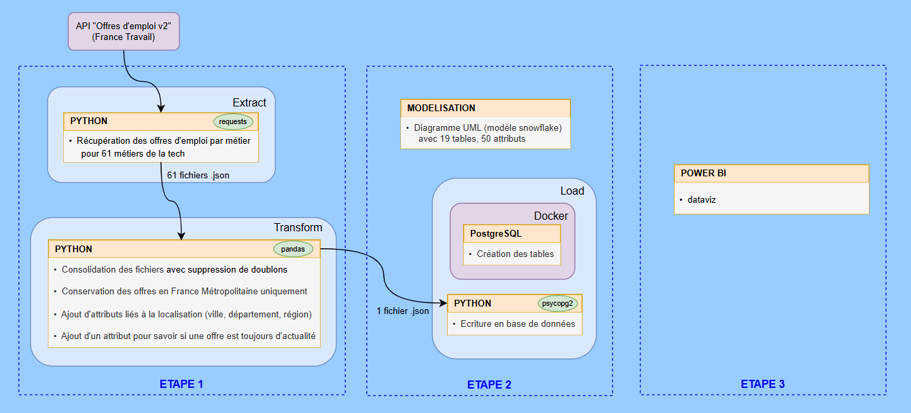

# Présentation du projet

- J'ai réalisé ce projet seul de bout en bout, dans le cadre de ma formation "Data Engineer" chez Data Scientest.

- Les étapes ont été les suivantes :

  - [1. Extraction des données par API et Transformations](readme_pages/step_1__extract_and_transform_data.md)

  - [2. Chargement des données dans une base de données relationnelle](readme_pages/step_2__load_data_to_database.md)

  - [3. Consommation des données](readme_pages/step_3__data_consumption.md)

  - [4. Création d'une API pour la db, dockerisation de cette application et de la db PostGreSQL](readme_pages/step_4__api.md)

  - [5. Orchestration avec Airflow](readme_pages/step_5__airflow_orchestration.md)

# Workflow du projet

- Voici un schéma récapitulatif des différentes étapes du projet :

  

# Arborescence du projet

- à remplir avec commentaires