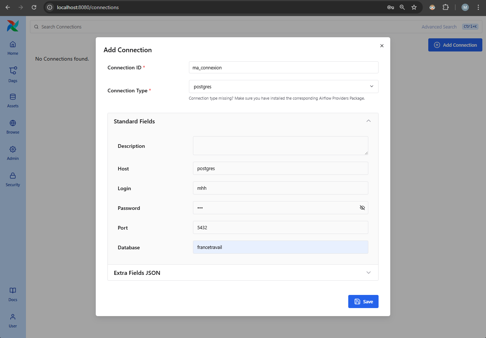
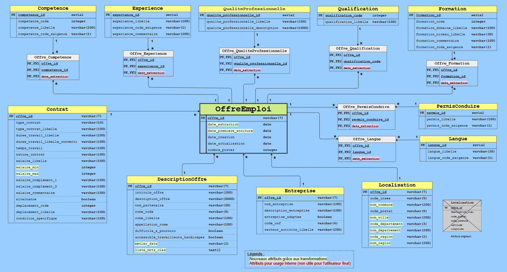

# Présentation du projet

- J'ai réalisé ce projet seul de bout en bout, dans le cadre de ma formation "Data Engineer" chez Data Scientest.

- Les objectifs sont globalement de :

  - mettre en place un pipeline ETL/ELT pour récupérer les offres d'emploi par API sur https://francetravail.io/data/api, étudier les attributs disponibles et faire le diagramme UML, effectuer des transformations en amont ou en aval de l'écriture des données dans une base de données Postgres,

  - consommer les données avec la mise en place de rapports avec Power BI,

  - travailler avec un environnement docker,

  - mettre en place une API pour qu'un utilisateur puisse requêter la base de données via une interface graphique,

  - orchestrer les tâches avec Airflow,

  - monitoring avec Prometheus et Grafana


- Pour ne pas surcharger cette page principale, une autre page avec des informations supplémentaires est disponible .


- Le plan suivant présente un plan logique plutôt que de présenter les étapes qui ont été effectuées par ordre chronologique :


## Sommaire

  todo : toc


# Slideshow

- Voici un aperçu du projet :

  todo : un gif peut être pas mal


# Skills set travaillés

- Python
- Pipeline ETL/ELT
- SQL
- Modélisation UML
- Linux
- Bash
- GIT

- FastAPI
- Docker
- Airflow
- Prometheus
- Grafana

- Power BI


# Environnement

## Environnement technique

- Développements et tests sous :
  - Windows 11 + WSL + Docker Desktop
  - Environnement virtuel, Python 3.12.9 (février 2025)
  - Airflow 3.0.2 (juin 2025), https://github.com/apache/airflow/releases


## Conditions initiales

- Pour avoir le projet en local :

  TODO : commande clone ?


- Avoir la configuration docker :

```bash
  # Pour initialiser Airflow et démarrer les services docker :
  #  (peut prendre du temps à avoir les services fonctionnels)
  ./scripts/docker_compose_down_up.sh


  # Pour redémarrer tous les services
  ./scripts/restart_all_docker_services.sh
  ```

- Côté Airflow :

  - Il faut que `DAG 1` soit activé dans la GUI, sinon la planification du DAG ne déclenchera pas du tout (`DAG1` n'est pas en `Queued` sur cette version, mais c'est tout comme, car le DAG se déclenchera lorsqu'il sera activé).
  - Il faut que `DAG 2` soit activé dans la GUI, sinon le `DAG 1` ne déclenchera pas le `DAG 2`, et il sera en `Queued`.

TODO : screenshot


# Urls de la GUI des applications

(todo : + screenshots)

| Application     | url                        |
| --------------- | -------------------------- |
| FastAPI         | http://localhost:8000/docs |
| Airflow         | http://localhost:8080/     |
| Prometheus      | http://localhost:9092/     |
| StatsD Exporter | http://localhost:9102/     |


# Prometheus

## Configuration de la collecte des métriques via StatsD

+ screenshot prometheus > status > targets

- Un `target` a été défini pour collecter les métriques provenant de `StatsD`, via le fichier de configuration `airflow/config/prometheus.yaml` :

```yaml
  scrape_configs:
    - job_name: statsd-exporter
      static_configs:
        - targets: ["statsd-exporter:9102"]
  ```

- `StatsD` est un collecteur de métriques qui permet à Airflow d'envoyer des données sous forme de métriques formatées en StatsD, et de les exposer via un `statsd-exporter` configuré pour Prometheus.

- Un autre fichier de configuration `airflow/config/statsd.yaml` permet de définir des mappings à partir des métriques issues d'Airflow, avec la possibilité de modifier le nom de la requête promQL.

  - https://github.com/databand-ai/airflow-dashboards/blob/main/statsd/statsd.conf


- Mappings Airflow disponible dans la doc : https://airflow.apache.org/docs/apache-airflow/stable/logging-monitoring/metrics.html


## Métriques

### Métriques de StatsD

Les métriques disponibles sont celles renvoyées par la commande `curl http://localhost:9102/metrics`, également disponibles dans le fichier `readme_files/metrics_statsd`.


## Check

```bash
docker exec -it prometheus sh  # l'image de prometheus ne contient pas bash

/prometheus $ promtool check config /etc/prometheus/prometheus.yaml
##==> Checking /etc/prometheus/prometheus.yaml
##==>  SUCCESS: /etc/prometheus/prometheus.yaml is valid prometheus config file syntax
```


# Arborescence des fichiers du projet

## Sans la partie liée à la conf Docker

```bash
  .
  ├── _archives/                       # fichiers archivés non importants
  │   └── notebooks/                   # fichiers notebooks qui ont servi pour créer les scripts
  │
  ├── .venv/                           # environnements virtuels
  │
  ├── airflow/                         # application Airflow
  │   ├── config/                      # contient le fichier fichier de conf "airflow.cfg"
  │   ├── dags/                        # contient "DAG 1" et "DAG 2"
  │   ├── data/
  │   │   ├── outputs/                 # contient les jsons récupérés par API, et le json qui les aggrège avec les transformations Python
  │   │   └── resources/               # contient les différents fichiers nécessaires au lancement du DAG 1
  │   ├── logs/                        # contient les logs des DAGs
  │   └── plugins/                     # contient les plugins (dossier non utilisé pour le moment)
  │  
  ├── drawio_files/                    # fichiers .drawio (schémas explicatifs)
  │  
  ├── fastapi/                         # application FastAPI
  │   ├── sql_requests/                # requêtes SQL utilisées par le script fastapi
  │   └── main.py                      # script fastapi
  │  
  ├── power_bi/                        # contient le fichier .pbix
  │  
  ├── readme_files/                    # contient `README_additional_notes.md` et d'autres fichiers (screenshots...)
  │  
  ├── scripts/                         # contient des scripts bash
  │  
  ├── .env/                            # fichier utile pour Airflow
  ├── .gitattributes                   # calcul stats sur github
  ├── .gitignore                       # ne pas pousser les fichiers spécifiés sur git
  ├── README.md                        # doc principale
  ├── requirements.txt                 # libs python utilisés dans le projet
  ├── ruff.toml                        # fichier de conf ruff pour le formattage python
  └── todo.md                          # fichiers listant les idées/actions prévues
  ```


## Avec seulement la configuration Docker

```bash
  .
  ├── airflow/                         # application Airflow
  │   ├── requirements.txt             # dépendances nécessaires pour le Dockerfile
  │   └── Dockerfile                   # construction du conteneur Airflow
  │  
  ├── fastapi/                         # application FastAPI
  │   ├── requirements.txt             # dépendances nécessaires pour le Dockerfile
  │   └── Dockerfile                   # construction du conteneur FastAPI
  │  
  └── docker-compose.yml               # orchestration docker pour postgres + fastapi + les services Airflow
  ```

### Docker compose

- Le fichier `docker-compose.yml` décrit les différents services déployés :

  - `postgres`,
  - `fastapi`,
  - `redis`,
  - `airflow-apiserver`,
  - `airflow-scheduler`,
  - `airflow-dag-processor`,
  - `airflow-worker`,
  - `airflow-triggerer`,
  - `airflow-init`,
  - `airflow-cli`,
  - `flower`.


## Configuration Fastapi

- Le `docker-compose.yml` décrit des montages de volumes pour ne pas avoir à redémarrer le docker-compose après chaque modification de fichiers sql, par exemple.

- A noter pour le `Dockerfile` :

  - Lors de la phase de développement :
    - l'option `--reload` peut être passée pour ne pas avoir à relancer la commande après une modification : `CMD ["uvicorn", "main:app", "--host", "0.0.0.0", "--port", "8000", "--reload"]`

  - En phase de prod (développements terminés) :
    - sans l'option `--reload` : `CMD ["uvicorn", "main:app", "--host", "0.0.0.0", "--port", "8000"]`
    - `COPY` du script python, et des fichiers nécessaires dans le conteneur (fichier csv, fichiers sql), au lieu de passer par des montages de volumes


# Workflow du projet avec Airflow

## Avant Airflow

- Avant d'appliquer Airflow au projet, 2 scripts python étaient nécessaires.
- Pour résumer et simplifier ce qu'ils faisaient ("simplifier" ici car ces scripts ont été remplacés par des DAGs qu'on détaillera après) :
  - Le premier récupérait les données de France Travail, faisait des transformations, et chargeait les offres d'emploi dans un json.
  - Le second lisait le json puis écrivait les offres d'emploi dans la base de données, et effectuait un deuxième lot de transformations à partir de fichier sql.

  


- Reprendre ces scripts pour avoir Airflow dans le projet a été bénéfique :
  - amélioration des fonctions définis
  - code plus compréhensible : factorisation de code, changement des noms de variables, revue des commentaires
  - meilleure façon d'écrire les offres d'emploi dans le json
  - meilleure gestion des cas d'erreur, et gestion d'erreur auquel on n'était pas confronté auparavant (exemple avec la parallélisation des requêtes et les erreurs 429 `Too much requests`)
  - simplification des requêtes sql


## Avec Airflow

- Les bénéfices d'Airflow sur ce projet sont multiples et évidents :

  - avoir une vision claire du workflow complet à travers la vue Graph du DAG
  - voir quelle fonction pose problème d'un coup d'oeil en cas d'échec et voir les logs associés à la tâche en échec
  - lancer le workflow complet à la fréquence désirée (par exemple, tous les jours à 20h)
  - et surtout obtenir un gain de temps avec la parallélisation de certaines tâches :
    - requêtes API pour récupérér les offres d'emploi pour x métiers en parallèle,
    - requêtes SQL pour remplir x tables en parallèle,
    - requêtes SQL pour effectuer x transformations en parallèle.


## Version utilisée

- Au moment d'écrire les DAGs, il y avait deux versions majeures : la 2.11.0 et la 3.0.2.

- Finalement, le choix se portera sur la version 3.0.2 car cette nouvelle branche a des évolutions majeures (https://airflow.apache.org/blog/airflow-three-point-oh-is-here/).


## Description du worflow des DAGs

Ci-dessous le nom d'une `tâche` avec une description.

Pour alléger le texte, on écrira :

- `fichier_existant.json` : fichier json aggrégeant les fichiers jsons téléchargés.
- `dossier_A` : dossier contenant tous les fichiers json téléchargés par api.
- `dossier_B` : dossier contenant le json `fichier_existant.json`.
- `all_in_one.json` : fichier json aggrégeant les fichiers jsons téléchargés en cours de construction, avant renommage.


### DAG 1

TODO : screenshot de DAG 1 à la fin du projet

#### Task group "setup"

##### Task group "check_files_in_folders"


- `S1_delete_all_in_one_json`

  - Suppression du fichier `all_in_one.json` s'il existe dans le `dossier_B`.


- tâches en parallèle :

  - `S1_count_number_of_json_file`

    - Vérification du nombre de fichiers json dans le `dossier_B` :
      - s'il y a plusieurs fichiers json : fin du DAG (exception levée).
      - s'il y a 0 ou 1 fichier json `fichier_existant.json` : on continue et on retourne "count", qui représente le nombre de fichiers json (0 ou 1 donc) et qui servira plus tard dans ce DAG.


  - `S1_check_csv_file_exists`, `S1_check_appellation_yaml_file_exists`, `S1_check_credentials_yaml_file_exists`

    - Vérification de la présence de ces fichiers :
      - si un des fichiers n'existe pas : fin du DAG (exception levée).


##### Task group "after_checks"

- `S2_remove_all_json_files`

  - Suppression des fichiers json dans le `dossier_A`.
    - Après suppression, on vérifie qu'il n'y a plus de fichier json (s'il reste un fichier json : fin du script).


- `S2_load_appellations_yaml_file`

  - Chargement du fichier yaml avec les 61 métiers de la tech.


- `S2_get_creds_from_yaml_file` puis `S2_get_token`

  - La première tâche récupère des credentials depuis le fichier.
  - La seconde tâche récupère le token API pour la suite.


#### Task group "ETL"


- `A1_get_offers`

  - Récupération et écriture des offres d'emploi dans des fichiers json dans le `dossier_A` [requests] + vérification de la validité des fichiers json.
  - Le fichier yaml décrivant 61 métiers, Airflow exécute ici 61 `mapped tasks` en parallèle.


- `A2_all_json_in_one`

  - Consolidation de tous les fichiers json du `dossier_A` en un seul fichier json `all_in_one.json` dans le `dossier_B` et suppression des doublons [pandas].


- `A3_only_metropole`

  - Conservation uniquement dans les offres d'emploi en France Métropolitaine dans `all_in_one.json` [pandas].


- `A4_add_location_attrs`

  - Ajout d'attributs dans `all_in_one.json` : `nom_commune`, `nom_ville`, `code_departement`, `nom_departement`, `code_region`, `nom_region`, à partir du code insee, coordonnées GPS et autres infos [pandas/geopy].


- `A5_add_dateExtraction_attr`

  - Ajout d'un attribut dans `all_in_one.json` : `date_extraction`, pour connaitre la date d'extraction et la date où on écrit la première fois dans la base [pandas].


- `A6_0_or_1_json_on_setup`

  - Vérification du nombre de fichiers json dans le `dossier_B`.


##### Task group "0_file_in_folder"

- Cas où il n'y a pas de fichier json dans le `dossier_B` (variable `count=0`).

  - `A8_add_date_premiere_ecriture_attr`

    - Ajout d'un attribut dans `all_in_one.json` : `date_premiere_ecriture` [pandas].


  - `A9_rename_json_file`

    - Renommage du fichier `all_in_one.json` en `date__extraction_occurence_1.json` (car il s'agit de la première extraction)


##### Task group "1_file_in_folder"

- Cas où il y a 1 fichier json `fichier_existant.json` dans le `dossier_B` (variable `count=1`).

  - `A7_special_jsons_concat`

    - Concaténation spéciale entre le json existant et le nouveau json, détails de l'algo () [pandas]

    - Renommage du fichier `all_in_one.json` en `date__extraction_occurence_N+1.json`, si le fichier existant était nommé `date__extraction_occurence_N.json`.

    - Déplacement de l'ancien json existant `date__extraction_occurence_N.json` dans le dossier `archives`.


  - `A8_add_date_premiere_ecriture_attr`

    - Ajout d'un attribut dans `all_in_one.json` : `date_premiere_ecriture` [pandas].

      - Notes : l'attribut `date_premiere_ecriture` prendra la date du jour pour toutes les nouvelles offres, et conservera l'ancienne valeur pour les anciennes offres.


- `A10_write_to_history`

  - Ecriture de l'historique du fichier json dans `_json_files_history.csv` (ajout nom json restant dans le dossier et le nombre de lignes).

- `trigger_dag_2`

  - Déclenchement du `DAG 2` si `DAG` OK


### DAG 2

TODO : screenshot de DAG 2 à la fin du projet

#### setup

- `check_only_one_json_in_folder`

  - Vérification qu'il n'y ait qu'un json `fichier_existant.json` dans `dossier_B`


- `remove_all_split_jsons`

  - Suppression des fichiers json dans le `dossier_A`.


- `ensure_postgres_connexion`

  - Vérification de l'existence de la connexion postgres nommée `connection_postgres`, et que ses paramètres sont conformes à celles spécifiés dans le script.
    - Suppression et création de celle-ci en cas de paramètres non conformes.

  - Création de la connexion si connection inexistante.

  - Note : on peut vérifier que la connexion est bien créée via la GUI comme montré sur le screenshot suivant :

    

    (si la connexion n'est pas bien définie, alors le `DAG 2` posera problème puisqu'il ne pourra pas intéragir avec la base de donnée `francetravail`)


- `split_large_json`

  - Split le gros fichier json final en plusieurs jsons dédiés pour les tâches suivantes du DAG.
  - L'intérêt est que toutes les tâches ne lisent pas le même gros fichier json, et que chaque tâche lise chacun son fichier json dédié.


- `SQLExecuteQueryOperator()` avec le fichier `sql/create_all_tables.sql`

  - Création de toutes les tables du projet si elles n'existent pas.


#### without_junction

Ce groupe exécute en parallèle les tâches suivantes, qui consistent à récupérer les informations dans les fichiers json dédiés (générés par la tâche `split_large_json`) et exécutent des `INSERT INTO` dans les tâches dédiés :

- `OffreEmploi`
- `Contrat`
- `Entreprise`
- `Localisation`
- `DescriptionOffre`


#### with_junction

Ce groupe exécute les actions suivantes :

Prenons pour exemple, `Competence` puis `Offre_Competence`

  1/ `INSERT INTO` pour la table de dimension
  2/ Requête pour connaitre la correspondance entre `offre_id` et `competence_id` avant de faire des `INSERT INTO` pour la table de liaison
  3/ Conservation de l'offre la plus récente, si `competence_id` a évolué


- `Competence` puis `Offre_Competence`
- `Experience` puis `Offre_Experience`
- `Formation` puis `Offre_Formation`
- `QualiteProfessionnelle` puis `Offre_QualiteProfessionnelle`
- `Qualification` puis `Offre_Qualification`
- `Langue` puis `Offre_Langue`
- `PermisConduire` puis `Offre_PermisConduire`


#### transformations

Plusieurs `SQLExecuteQueryOperator()` qui exécutent séquentiellement les tâches suivantes, dont les fichiers SQL du dossier `airflow/dags/sql` sont :

  - `update_descriptionoffre_metier_data_DE`
  - `update_descriptionoffre_metier_data_DA`
  - `update_descriptionoffre_metier_data_DS`
  - `update_contrat_salaires_min_max`
  - `update_descriptionoffre_column_liste_mots_cles`


# Extraction des données par API

- France Travail (https://francetravail.io/data/api) met à disposition plusieurs APIs, dont "Offres d'emploi v2" (`GET https://api.francetravail.io/partenaire/offresdemploi`).

- Le endpoint `GET https://api.francetravail.io/partenaire/offresdemploi/v2/offres/search` permet de récupérer les offres d'emploi actuelles selon plusieurs paramètres dont :

  - le code des appellations ROME pour filtrer par métier (codes récupérés à partir du endpoint `GET https://api.francetravail.io/partenaire/offresdemploi/v2/referentiel/appellations`) :

    ```json
    { "code": "38971",  "libelle": "Data_Analyst" },
    { "code": "38972",  "libelle": "Data_Scientist" },
    { "code": "404278", "libelle": "Data_Engineer" },
    { "code": "38975",  "libelle": "Data_Manager" },
    ...
    ```

  - le code des pays (codes récupérés à partir du endpoint `GET https://api.francetravail.io/partenaire/offresdemploi/v2/referentiel/pays`) :

    ```json
    { "code": "01", "libelle": "France" },     // inclut les offres en France d'outre-mer et en Corse
    { "code": "02", "libelle": "Allemagne" },  // les pays étrangers ne retournent malheureusement pas d'offre sur les métiers à analyser
    ...
    ```

  - le paramètre `range` qui limite les résultats à 150 offres par requête (avec un status code à `206` si une requête renvoie plus de 150 offres), sachant que l'API ne permet de récupérer que 3150 offres au maximum par appellation ROME.

    - Ainsi, si une requête renvoit 351 offres, il faut enchainer 3 requêtes pour obtenir toutes les offres (la première requête donne les offres `0-149` (status code 206), la deuxième donne les offres `150-299` (status code 206), et la troisième donne les offres `300-350` (status code 200)).


- Cet API retourne des offres d'emploi sous forme de documents json avec énormément d'attributs dont l'identifiant de l'offre, son intitulé, sa description, le lieu de travail, des informations sur l'entreprise et sur le contrat, les compétences demandées et l'expérience nécessaires, etc...

- Toutefois, l'API retourne aussi énormément d'offres sans lien avec le métier renseigné en paramètre (par exemple, une requête renseignant l'appellation `Data Engineer` peut renvoyer une offre telle que `Product Owner` car les termes `Data Engineer` peuvent être présents dans la description de l'offre d'emploi).

- On va requêter ainsi un large panel de métiers, dont 29 ayant un lien avec la data, et 32 ayant un lien avec les métiers de la tech (dev, sécurité, devops...), pour maximiser les chances d'obtenir le plus d'offres d'emploi ayant un lien avec les métiers `DE`, `DA` et `DS`, et aussi pour avoir une base de données plus conséquente.

  - En effet, des offres de `Data Engineer` peuvent être présentes en requêtant l'appellation `Data Manager` par exemple.

- On obtient finalement 61 fichiers json contenant toutes les offres d'emploi liées ou pas à la data, pour la France et DOM-TOM uniquement, l'API de France Travail ne renvoyant quasiment pas d'offre d'emploi pour les autres pays.

- Plusieurs transformations seront effectuées par la suite : 


- Notes :

  - Les paramètres liés aux dates (`minCreationDate`, `maxCreationDate`, `publieeDepuis`) ne permettent pas d'obtenir des offres expirées (par exemple celles qui ont permis de recruter quelqu'un).

  - Les offres d'emploi retournées peuvent provenir soit de `FRANCE TRAVAIL`, soit des `partenaires` (par exemple `CADREMPLOI`, `DIRECTEMPLOI`, `INDEED`, etc...)


# Transformations des données

## Transformations des données en amont (côté Python)

Ces transformations sont faites dans le `DAG 1`, faites via Python et en amont du chargement dans la base Postgres :

  - Concaténation des 61 fichiers json dans un seul fichier json, avec suppression des doublons

  - Conservation des offres en France Métropolitaine uniquement, 

  - Ajout des attributs de localisation des offres (noms et codes des villes, départements, départements et régions), 

  - Ajout des attributs `date_premiere_ecriture` et `date_extraction` :

    - `date_extraction` aura la date du jour à laquelle le `DAG 1` a été lancé,
    - `date_premiere_ecriture` aura la date du jour pour toutes les nouvelles offres, mais prendra les anciennes valeurs pour les anciennes offres.


## Transformations des données en aval (côté SQL)

Ces transformations sont faites dans le `DAG 2`, faites via des requêtes SQL et effectuées en aval de l'écriture dans la base Postgres :

  - pour créer et écrire l'attribut `metier_data` : pour chaque offre, on comparera l'attribut `intitule_offre` avec des regex afin de déterminer s'il s'agit d'une offre pour un `Data Engineer`, un `Data Analyst`, ou un `Data Scientist`.

    - 

  - pour créer et écrire les attributs `salaire_min` et `salaire_max` en fonction d'un algorithme expliqué

    - 


# Chargement des données dans une base de données relationnelle

- L'API de France Travail contient beaucoup d'attibuts pour une offre d'emploi, qui seront quasiment tous exploités par la suite.

  - Seuls les attributs liés aux `contacts` et aux `agences` ne seront pas conservés, n'apportant pas d'utilité.


- Pour la suite, une modélisation `snowflake` est utilisée, dont le diagramme UML est .

  TODO : justifier ce choix

- Le SGBD `PostgreSQL` sera utilisé :

  - Performant, sa fiable et sa flexible.
  - Offre une grande transparence et une forte extensibilité, en tant que solution open source.
  - Prend en charge des types de données complexes, respecte les principes ACID et bénéficie d’une communauté active assurant une évolution continue.

- La base de données `francetravail` sera hébergée dans le conteneur Docker exécutant le service PostgreSQL.

- Les données issues du json généré avec le `DAG 1` seront récupérées et écrites en base avec la librairie `psycopg2`.


## Mise à jour de la base de données après récupération de nouvelles offres

- Une offre d'emploi peut être mise à jour, et voir par exemple la valeur d'un de ses attributs modifiée.

- Il faut gérer ce cas et mettre à jour la base de données en écrasant l'ancienne valeur d'un attribut avec sa nouvelle valeur.

- Par exemple, on peut avoir une offre avec un `experience_libelle` passer de `expérience exigée de 3 an(s)` à `débutant accepté`.

- Même chose pour d'autres attributs.

- Pour gérer cela, l'attribut `date_extraction` est écrit dans toutes les tables de liaison.

- Ainsi, pour une offre, si un attribut d'une table de dimension associé à la table de liaison a évolué, alors on ne conservera que l'offre avec `date_extraction` le plus récent.

- Plus de détails .


# Power BI

- Power BI servira ici pour la data visualisation.


## Manipulations

- Ci-dessous des liens expliquant les différentes manipulations faites pour :

  - 

  - 

  - 

  - 


## Screenshots des rapports

TODO : faire à la fin du projet


# Création d'une API pour la db

- L'utilité peut par exemple être de requêter la db `francetravail` à travers l'interface OpenAPI (ex-swagger) pour récupérer certaines informations.

- Utilisation de `FastAPI`.

- Pour les réponses, on utilisera la librairie `tabulate` avec `media_type="text/plain"` pour afficher un tableau qui facilitera la lecture, et qui diminuera le nombre de lignes des réponses.


## Screenshots

TODO : faire à la fin du projet