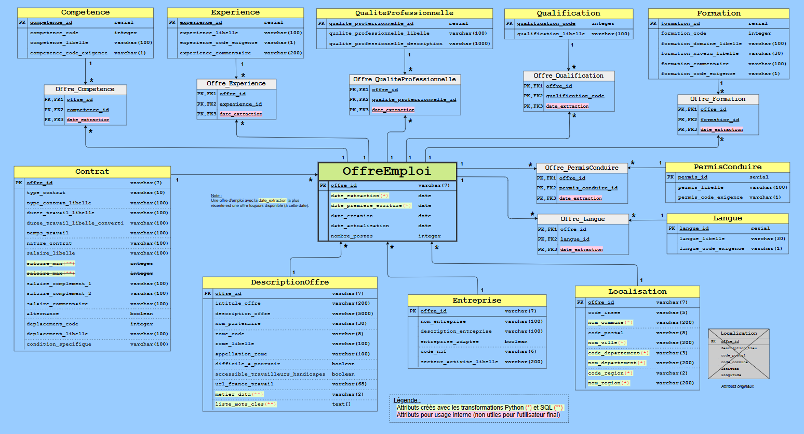
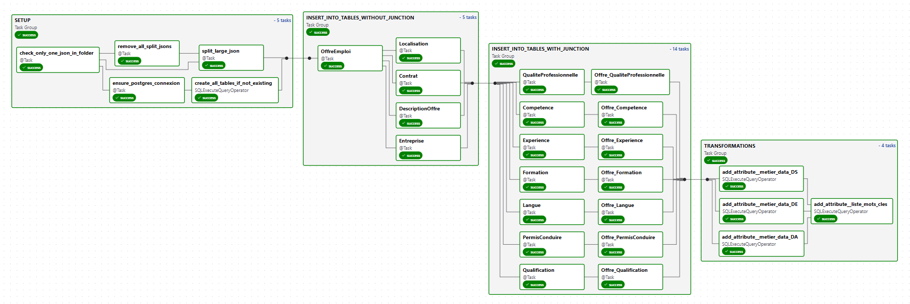
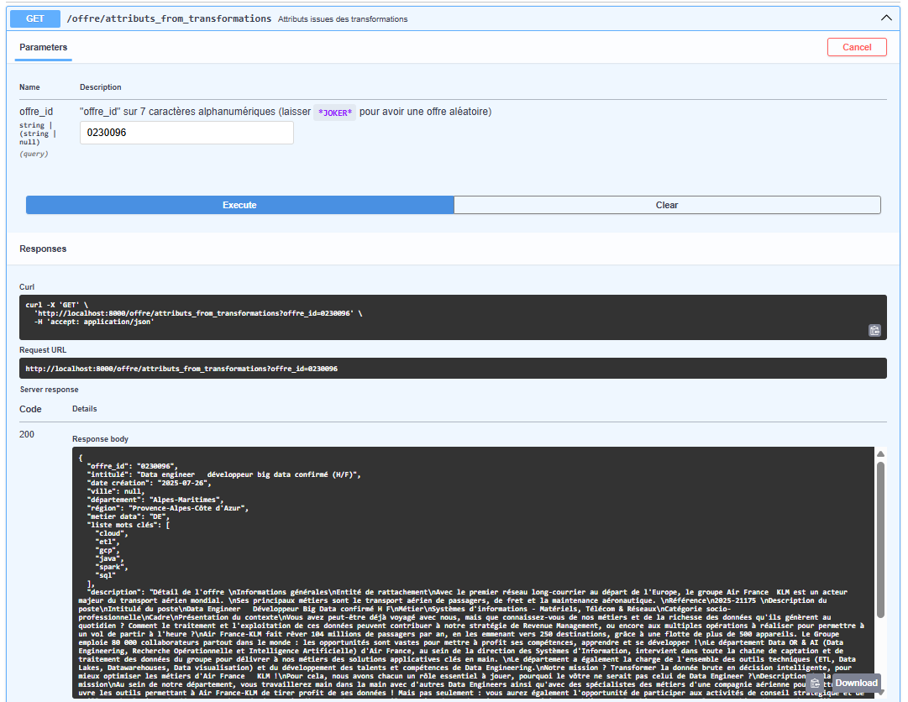
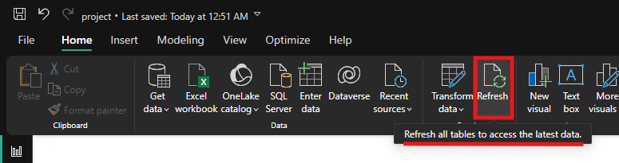

# Présentation du projet

- Bienvenue sur mon projet, que j'ai réalisé seul entièrement, dans le cadre de ma formation `Data Engineer` chez Data Scientest en 2025.

- L'objectif principal est d'analyser le marché du travail en France Métropolitaine à travers des offres d'emploi.

- Avant de présenter le [sommaire](#sommaire), voici un résumé et aperçu de ce qui a été effectué à travers quelques `.gif` (⚠️ cette page peut prendre un certain temps à charger à cause de la taille des `.gif`) :

  - Environnement dockerisé déployé avec `docker compose` :

     <br>

  - `Airflow` pour la mise en place du pipeline pipeline ETL avec deux DAGs (`DAG 1` récupère les offres d'emploi par API, effectue des transformations avant d'écrire toutes les offres d'emploi dans un fichier json, puis `DAG 2` écrit les offres dans une base de données `Postgres`) :

     <br>


  - `FastAPI` pour la mise en place d'une API :

     <br>


  - `Power BI` pour la consommation des données avec la création de rapports :

     <br>


  - `Prometheus et Grafana` pour le monitoring des `conteneurs Docker`, de la base de données `Postgres`, des `DAG`, et du `noeud` :

    


# Sommaire

(avec les sous-sections importantes uniquement)

- [1. Environnement](#1-environnement)
  - [Configuration pré-requise](#configuration-pré-requise)
  - [Configuration Docker](#Configuration-Docker)
  - [Version des services testés](#version-des-services-testés)
  - [Arborescence des fichiers du projet](#arborescence-des-fichiers-du-projet)
- [2. ETL avec Airflow](#2-etl-avec-airflow)
  - [Extraction des données par API](#extraction-des-données-par-api)
  - [Transformations des données](#transformations-des-données)
  - [Chargement des données dans une base de données relationnelle](#chargement-des-données-dans-une-base-de-données-relationnelle)
  - [Airflow](#airflow)
    - [Description du DAG 1](#description-du-dag-1)
    - [Description du DAG 2](#description-du-dag-2)
- [3. Création d'une API avec FastAPI](#3-création-dune-api-avec-fastapi)
- [4. Data Viz avec Power BI](#4-data-viz-avec-power-bi)
  - [Rapports](#rapports)
- [5. Monitoring avec Prometheus et Grafana](#5-monitoring-avec-prometheus-et-grafana)
  - [Prometheus](#prometheus)
  - [Grafana](#grafana)
- [6. Conclusion](#6-conclusion)
  - [Compétences techniques](#compétences-techniques)
  - [Difficultés rencontrées](#difficultés-rencontrées)
  - [Evolutions possibles du projet](#evolutions-possibles-du-projet)


- Pour ne pas surcharger cette page principale, une seconde page avec des informations supplémentaires moins essentielles est disponible [ici](readme_files/APPENDIX.md#readme-secondaire).


# 1. Environnement

- Une très grande partie de l'environnement de ce projet est dockerisé.

- Le fichier `drawio_files/architecture.drawio` donne une vue sur l'architecture du projet :

  


- Le développement et les tests ont eu lieu sous :

  - `Windows 11` + `WSL2` avec `Ubuntu 22.04`

    > Note : on n'utilise pas `Docker Desktop` mais `Docker CE dans WSL` car `cAdvisor` (Container Advisor) n'est pas opérationnel dans l'environnement `WSL` avec `Ubuntu 22.04` + `rocker Desktop`, voir [ici](readme_files/APPENDIX.md#Utilisation-de-Docker-CE-dans-WSL-pour-cAdvisor) pour les explications et pour la procédure d'installation de `Docker CE` dans `WSL`.

  - `Python 3.12.9` (février 2025) avec environnement virtuel (formatteur `Ruff`).


## Configuration pré-requise

- Avoir le projet en local :

```bash
  git clone git@github.com:vimchun/Job-Market-in-France.git
```

- Sur `https://francetravail.io/` :
  - Créer un compte
  - Ajouter les accès aux APIS `Marché du travail v1` et `Offres d'emploi v2` (voir screenshot)
  - Copier-coller les credentials (`identifiant client` + `clé secrète`) dans un nouveau fichier `airflow/data/resources/api_credentials.yml` (voir screenshot)

    ```yaml
      # contenu du fichier `airflow/data/resources/api_credentials.yml`
      FRANCE_TRAVAIL_API_CREDENTIALS:
        IDENTIFIANT_CLIENT: <à_remplir>
        CLE_SECRETE: <à_remplir>
    ```

    


- Si environnement Windows + WSL, utiliser `Docker CE` dans WSL, plutôt qu'utiliser `Docker Desktop` (voir cette [procédure](readme_files/APPENDIX.md#Installer-et-utiliser-Docker-CE-dans-WSL))


- Avoir les services Docker qui tournent :

```bash
  # Pour initialiser Airflow et démarrer tous les services docker (peut prendre quelques minutes pour que les services soient fonctionnels)
  ./scripts/docker_compose_down_up.sh true true

  # Si besoin de redémarrer tous les services
  ./scripts/restart_all_docker_services.sh
  ```

- Côté Airflow :

  - Activer `DAG 1` et `DAG 2` dans la [GUI](http://localhost:8080/dags) (par défaut, ils sont désactivés après une réinitialisation d'environnement) :

    

    - `DAG 1` doit être activé sinon la planification du DAG ne déclenchera pas du tout (`DAG 1` n'est pas en `Queued` sur cette version, mais c'est tout comme, car le DAG se déclenchera lorsqu'il sera activé).

    - `DAG 2` doit être activé sinon le `DAG 1` ne déclenchera pas le `DAG 2`, et il sera en `Queued`.


- Côté Prometheus :

  - L'état des targets doit être à `UP`, voir le screenshot de cette [section](#Configuration-de-Prometheus).


## Configuration Docker

- Les différents services sont déployés grâce à `docker compose`, avec le `docker-compose.yml` qui décrit les services suivants :

  - `postgres`,
  - `fastapi`,
  - `redis`, `airflow-apiserver`, `airflow-scheduler`, `airflow-dag-processor`, `airflow-worker`, `airflow-triggerer`, `airflow-init`, `airflow-cli`, `flower`,
  - `statsd-exporter`, `node-exporter`, `postgres-exporter`, `cAdvisor`,
  - `prometheus`,
  - `grafana`


### Schéma

- Le fichier `drawio_files/architecture.drawio` donne une vue des principaux services Docker déployée :

  


### Versions des services testés

- Le ficher `docker-compose.yml` ne spécifiant pas les versions pour les différents services (tag `latest` par défaut), il est important de noter les versions des services de l'écosystème.

- Ce [lien](readme_files/APPENDIX.md#récupération-des-versions) donne les commandes permettant de récupérer les versions.

- Tableau avec les versions utilisées (pour un éco-système fonctionnel) :

  | service           | version  | date de la release | lien                                                               |
  | ----------------- | -------- | ------------------ | ------------------------------------------------------------------ |
  | FastAPI           | 0.115.12 | 03/2025            | https://github.com/fastapi/fastapi/releases                        |
  | Postgres          | 16.9     | 05/2025            | https://github.com/postgres/postgres/tags                          |
  | Redis             | 8.0.3    | 07/2025            | https://github.com/redis/redis/releases                            |
  | Airflow           | 3.0.3    | 07/2025            | https://github.com/apache/airflow/releases                         |
  | StatsD-exporter   | 0.28.0   | 10/2024            | https://github.com/prometheus/statsd_exporter/releases             |
  | Node-exporter     | 1.9.1    | 04/2025            | https://github.com/prometheus/node_exporter/releases               |
  | Postgres-exporter | 0.17.1   | 02/2025            | https://github.com/prometheus-community/postgres_exporter/releases |
  | cAdvisor          | v0.49.1  | 03/2024            | https://github.com/google/cadvisor/releases                        |
  | Prometheus        | 3.5.0    | 07/2025            | https://github.com/prometheus/prometheus/releases                  |
  | Grafana           | 12.0.2   | 06/2025            | https://github.com/grafana/grafana/releases                        |


### Urls des GUIs

(todo : + screenshots)

  | Application       | Url                                                    | credentials       |
  | ----------------- | ------------------------------------------------------ | ----------------- |
  | FastAPI           | http://localhost:8000/docs                             |                   |
  | Airflow           | http://localhost:8080/                                 | airflow / airflow |
  | StatsD Exporter   | http://localhost:9102/ + http://localhost:9102/metrics |                   |
  | Node Exporter     | http://localhost:9100/ + http://localhost:9100/metrics |                   |
  | Postgres Exporter | http://localhost:9187/ + http://localhost:9187/metrics |                   |
  | cAdvisor          | http://localhost:8081/ + http://localhost:8081/metrics |                   |
  | Prometheus        | http://localhost:9092/ + http://localhost:9092/metrics |                   |
  | Grafana           | http://localhost:3000/                                 | grafana / grafana |


## Arborescence des fichiers du projet

### Sans la partie liée à la conf Docker

```bash
  .
  ├── _archives/                                 # fichiers archivés non importants
  │   └── notebooks/                             # fichiers notebooks qui ont servi pour créer les scripts
  │
  ├── .venv/                                     # environnements virtuels
  │
  ├── airflow/                                   # application Airflow
  │   ├── dags/                                  # contient "DAG 1", "DAG 2", et un dossier contenant des scripts sql pour les transformations
  │   ├── data/
  │   │   ├── outputs/                           # contient les jsons récupérés par API, et le json qui les aggrège avec les transformations Python
  │   │   └── resources/                         # contient les différents fichiers nécessaires au lancement du DAG 1
  │   ├── logs/                                  # contient les logs des DAGs
  │   └── airflow.cfg                            # fichier de conf
  │  
  ├── drawio_files/                              # fichiers .drawio (schémas explicatifs)
  │  
  ├── fastapi/                                   # application FastAPI
  │   ├── sql_requests/                          # requêtes SQL utilisées par le script fastapi
  │   ├── code_name__city_department_region.csv  # même fichier quand dans "airflow/data/resources", copié par point de montage
  │   ├── main.py                                # script fastapi
  │   └── offers_id.txt                          # fichier généré par le "DAG 1" qui contient uniquement les identifiants des offres d'emploi
  │  
  ├── grafana/
  │   └── provisioning/
  │       ├── dashboards/                        # contient un fichier de conf permettant notamment de ranger les dashboards dans leur dossier dans la GUI
  │       │   ├── mine/                          # contient mon dashboard
  │       │   └── others/                        # contient des dashboards téléchargés sur le site de grafana, et des dashboards avec les métriques préfixées par "airflow_" et "go_"
  │       └── datasources/                       # contient un fichier de conf qui permet la création du datasource "Prometheus"
  │  
  ├── power_bi/                                  # contient le fichier .pbix
  │  
  ├── prometheus/
  │   ├── available_metrics/                     # donne les métriques exposées relatives à (node|postgres|statsd)_exporter
  │   ├── prometheus.yaml                        # fichier de conf
  │   └── statsd-mapping-configs.yaml            # fichier de conf
  │  
  ├── readme_files/                              # contient `README_additional_notes.md` et d'autres fichiers (screenshots...)
  │  
  ├── scripts/                                   # contient des scripts bash
  │  
  ├── .env                                       # fichier utile pour Airflow
  ├── .gitattributes                             # calcul stats sur github
  ├── .gitignore                                 # ne pas pousser les fichiers spécifiés sur git
  ├── README.md                                  # doc principale
  ├── requirements.txt                           # libs python utilisés dans le projet
  ├── ruff.toml                                  # fichier de conf ruff pour le formattage python
  └── todo.md                                    # fichiers listant les idées/actions prévues
  ```


### Avec seulement la configuration Docker

```bash
  .
  ├── airflow/
  │   ├── requirements.txt             # dépendances nécessaires pour le Dockerfile
  │   └── Dockerfile                   # construction du conteneur Airflow
  │  
  ├── fastapi/
  │   ├── requirements.txt             # dépendances nécessaires pour le Dockerfile
  │   └── Dockerfile                   # construction du conteneur FastAPI
  │  
  └── docker-compose.yml               # orchestration docker pour postgres + fastapi + les services Airflow
  ```


# 2. ETL avec Airflow

  

## Extraction des données par API

- France Travail (https://francetravail.io/data/api) met à disposition plusieurs APIs, dont "Offres d'emploi v2" (`GET https://api.francetravail.io/partenaire/offresdemploi`).

- Le endpoint `GET https://api.francetravail.io/partenaire/offresdemploi/v2/offres/search` permet de récupérer les offres d'emploi actuelles selon plusieurs paramètres dont :

  - le code des appellations ROME pour filtrer par métier (codes récupérés à partir du endpoint `GET https://api.francetravail.io/partenaire/offresdemploi/v2/referentiel/appellations`) :

    ```jsonc
    { "code": "38971",  "libelle": "Data_Analyst" },
    { "code": "38972",  "libelle": "Data_Scientist" },
    { "code": "404278", "libelle": "Data_Engineer" },
    { "code": "38975",  "libelle": "Data_Manager" },
    ...
    ```

  - le code des pays (codes récupérés à partir du endpoint `GET https://api.francetravail.io/partenaire/offresdemploi/v2/referentiel/pays`) :

    ```jsonc
    { "code": "01", "libelle": "France" },     // inclut les offres en France d'outre-mer et en Corse
    { "code": "02", "libelle": "Allemagne" },  // les pays étrangers ne retournent malheureusement pas d'offre sur les métiers à analyser
    ...
    ```

  - le paramètre `range` qui limite les résultats à 150 offres par requête (avec un status code à `206` si une requête renvoie plus de 150 offres), sachant que l'API ne permet de récupérer que 3150 offres au maximum par appellation ROME.

    - Ainsi, si une requête renvoit 351 offres, il faut enchainer 3 requêtes pour obtenir toutes les offres (la première requête donne les offres `0-149` (status code 206), la deuxième donne les offres `150-299` (status code 206), et la troisième donne les offres `300-350` (status code 200)).


- Cet API retourne des offres d'emploi sous forme de documents json avec énormément d'attributs dont l'identifiant de l'offre, son intitulé, sa description, le lieu de travail, des informations sur l'entreprise et sur le contrat, les compétences demandées et l'expérience nécessaires, etc...

- Toutefois, l'API retourne aussi énormément d'offres sans lien avec le métier renseigné en paramètre (par exemple, une requête renseignant l'appellation `Data Engineer` peut renvoyer une offre telle que `Product Owner` car les termes `Data Engineer` peuvent être présents dans la description de l'offre d'emploi).

- On va requêter ainsi un large panel de métiers, dont 29 ayant un lien avec la data, et 32 ayant un lien avec les métiers de la tech (dev, sécurité, devops...), pour maximiser les chances d'obtenir le plus d'offres d'emploi ayant un lien avec les métiers `DE`, `DA` et `DS`, et aussi pour avoir une base de données plus conséquente.

  - En effet, des offres de `Data Engineer` peuvent être présentes en requêtant l'appellation `Data Manager` par exemple.

- On obtient finalement 61 fichiers json contenant toutes les offres d'emploi liées ou pas à la data, pour la France et DOM-TOM uniquement, l'API de France Travail ne renvoyant quasiment pas d'offre d'emploi pour les autres pays.

- Plusieurs transformations seront effectuées par la suite : [voir ici](#transformations-des-données-en-amont-côté-python).


> Notes :
>
>  - Les paramètres liés aux dates (`minCreationDate`, `maxCreationDate`, `publieeDepuis`) ne permettent pas d'obtenir des offres expirées (par exemple celles qui ont permis de recruter quelqu'un).
>
>  - Les offres d'emploi retournées peuvent provenir soit de `FRANCE TRAVAIL`, soit des `partenaires` (par exemple `CADREMPLOI`, `DIRECTEMPLOI`, `INDEED`, etc...)
>
>  - Pour ouvrir le lien d'une offre d'emploi : `https://candidat.francetravail.fr/offres/recherche/detail/<offre_id>` (remplacer `offre_id` dans ce [lien](https://candidat.francetravail.fr/offres/recherche/detail/offre_id)).
>
>  - Exemple d'un document json extrait (pour une offre d'emploi donc) :
>
>  


### Pas d'autre source de données ?

- Il existe de multiples sources de données sur les offres d'emploi (par exemple : `The Muse` ou `Adzuna`).

- Les raisons pour lesquelles on ne garde que la source de `France Travail` sont les suivantes :

  - ~60 attributs pour chaque offre d'emploi récupérée chez `France Travail` vs ~10 chez `The Muse` ou `Adzuna`

  - Impossible de traiter si une même offre est disponible entre deux sources (identifiant différent, url différent), donc impossible de merger les offres venant de ces différentes sources, sauf si avoir des doublons n'est pas un problème, ce qui n'est pas le cas sur ce projet où on se focalisera sur un jeu de données propre sans doublon.

  - Identifiants des offres :
    - "France Travail" : id sur 7 caractères alphanumériques
    - "Adzuna" : sur 10 digits
    - "The Muse" : 7 ou 8 digits


## Transformations des données

### Transformations des données en amont (côté Python)

- Ces transformations sont faites dans le `DAG 1`, faites via Python et en amont du chargement dans la base Postgres :

  - Concaténation des 61 fichiers json dans un seul fichier json, avec suppression des doublons

  - Conservation des offres en France Métropolitaine uniquement, [détails ici](readme_files/APPENDIX.md#conservation-des-offres-en-France-Métropolitaine-uniquement).

  - Ajout des attributs de localisation des offres (noms et codes des villes, départements, départements et régions), [détails ici](readme_files/APPENDIX.md#attributs-de-localisation-des-offres-noms-et-codes-des-villes-communes-départements-et-régions).

  - Ajout des attributs `date_premiere_ecriture` et `date_extraction` :

    - `date_extraction` aura la date du jour à laquelle le `DAG 1` a été lancé,
    - `date_premiere_ecriture` aura la date du jour pour toutes les nouvelles offres, mais prendra les anciennes valeurs pour les anciennes offres.


### Transformations des données en aval (côté SQL)

- Ces transformations sont effectuées dans le `DAG 2`, faites via des requêtes `SQL` et effectuées en aval de l'écriture dans la base Postgres :

  - Pour créer et écrire l'attribut `metier_data` :

    - Pour chaque offre, on comparera l'attribut `intitule_offre` avec des regex afin de déterminer s'il s'agit d'une offre pour un `Data Engineer`, un `Data Analyst`, ou un `Data Scientist`.

    - [détails ici](readme_files/APPENDIX.md#attribut-metier_data)


  - Pour créer et écrire l'attribut `liste_mots_cles` :

    - Pour chaque offre, si un mot-clé parmi la liste de strings prédéfinie ici[script](airflow/dags/sql/transformation_4_update__table_descriptionoffre__column__liste_mots_cles.sql), ce mot-clé sera ajouté dans l'attribut (qui est une liste).


> Note :
>
> - Une transformation a été créée pour récupérer les valeurs pour les attributs `salaire_min` et `salaire_max` à partir de l'attribut `salaire_libelle`, en fonction d'un algorithme expliqué [ici](readme_files/APPENDIX.md#attributs-salaire_min-et-salaire_max).
>
> - Dans la plupart des cas, les salaires récupérés sont corrects, mais il reste parfois certaines incohérences, liés aux erreurs de saisie de la part des recruteurs dans l'attribut `salaire_libelle`, qui amènent à trop de cas d'erreurs à traiter.
>
>   - Par conséquent, cette transformation ne sera pas retenue.


## Chargement des données dans une base de données relationnelle

- L'API de France Travail contient beaucoup d'attibuts pour une offre d'emploi, qui seront quasiment tous exploités par la suite.

  - Seuls les attributs liés aux `contacts` et aux `agences` ne seront pas conservés, n'apportant pas d'utilité.


- Pour la suite, une modélisation `snowflake` est utilisée, dont le diagramme UML est le suivant :

  

  - Table de fait en vert
  - Tables de liaison en gris
  - Tables de dimension en vert


  TODO : justifier ce choix

- Le SGBD `PostgreSQL` sera utilisé :

  - Performant, sa fiable et sa flexibilité.
  - Prise en charge des types de données complexes, respecte les principes ACID.
  - Grande transparence en tant que solution open source.
  - Communauté active assurant une évolution continue.

- La base de données `francetravail` sera hébergée dans le conteneur Docker exécutant le service PostgreSQL.

- Les données issues du json généré avec le `DAG 1` seront récupérées et écrites en base avec la librairie `psycopg2`.


### Mise à jour de la base de données après récupération de nouvelles offres

- Une offre d'emploi peut être mise à jour, et voir par exemple la valeur d'un de ses attributs modifiée.

- Il faut gérer ce cas et mettre à jour la base de données en écrasant l'ancienne valeur d'un attribut avec sa nouvelle valeur.

- Par exemple, on peut avoir une offre avec un `experience_libelle` passer de `expérience exigée de 3 an(s)` à `débutant accepté`.

- Même chose pour d'autres attributs.

- Pour gérer cela, l'attribut `date_extraction` est écrit dans toutes les tables de liaison.

- Ainsi, pour une offre, si un attribut d'une table de dimension associé à la table de liaison a évolué, alors on ne conservera que l'offre avec `date_extraction` le plus récent.

- Plus de détails [ici](readme_files/APPENDIX.md#mise-à-jour-de-la-base-de-données-après-récupération-de-nouvelles-offres).


## Airflow

### Avant Airflow

- Avant d'appliquer Airflow au projet, deux scripts python étaient exécutées.
- Pour résumer et simplifier ce qu'ils faisaient ("simplifier" ici car ces scripts ont été remplacés par des DAGs qu'on détaillera après) :
  - Le premier récupérait les données de France Travail, faisait des transformations, et chargeait les offres d'emploi dans un json.
  - Le second lisait le json puis écrivait les offres d'emploi dans la base de données, et effectuait un deuxième lot de transformations à partir de fichier sql.

  


- Reprendre ces scripts pour intégrer Airflow dans le projet a été très bénéfique :
  - amélioration des fonctions définis
  - code plus compréhensible : factorisation de code, changement des noms de variables, revue des commentaires
  - meilleure façon d'écrire les offres d'emploi dans le json
  - meilleure gestion des cas d'erreur, et gestion d'erreur auquel on n'était pas confronté auparavant (exemple avec la parallélisation des requêtes et les erreurs 429 `Too much requests`)
  - simplification des requêtes sql


### Avec Airflow

- Les autres bénéfices d'Airflow sur ce projet sont multiples et évidents :

  - avoir une vision claire du workflow complet à travers la vue Graph du DAG
  - voir quelle fonction pose problème d'un coup d'oeil en cas d'échec et voir les logs associés à la tâche en échec
  - lancer le workflow complet à la fréquence désirée (par exemple, tous les jours à 20h)
  - et surtout obtenir une optimisation et un gain de temps considérable, avec la parallélisation de certaines tâches :
    - requêtes API pour récupérér les offres d'emploi pour x métiers en parallèle,
    - requêtes SQL pour remplir x tables en parallèle,
    - requêtes SQL pour effectuer x transformations en parallèle.


### Version utilisée

- Au moment d'écrire ces lignes, deux branches majeures : la `2.x` et la `3.x`.

- Finalement, le choix se portera sur la branche `3.x` (avec la récente `3.0.3`) qui contient des évolutions majeures (détails [ici](https://airflow.apache.org/blog/airflow-three-point-oh-is-here/)).


## Description des DAGs

- Ci-dessous le nom d'une `tâche` avec une description.

- Pour alléger le texte, on écrira :

  - `fichier_existant.json` : fichier json aggrégeant les fichiers jsons téléchargés.
  - `dossier_A` : dossier contenant tous les fichiers json téléchargés par api.
  - `dossier_B` : dossier contenant le json `fichier_existant.json`.
  - `all_in_one.json` : fichier json aggrégeant les fichiers jsons téléchargés en cours de construction, avant renommage.


### Description du DAG 1

- Vue "graph" du `DAG 1` :

  


#### Task Group "SETUP"

> `Sub Task Group "check_files_in_folders"` :
>
> - `S1_delete_all_in_one_json` :
>
>   - Suppression du fichier `all_in_one.json` s'il existe dans le `dossier_B`.
>
>
> - Tâches en parallèle :
>
>   - `S1_count_number_of_json_file` :
>
>     - Vérification du nombre de fichiers json dans le `dossier_B` :
>       - s'il y a plusieurs fichiers json : fin du DAG (exception levée).
>       - s'il y a 0 ou 1 fichier json `fichier_existant.json` : on continue et on retourne `count`, qui représente le nombre de fichiers json (0 ou 1 donc) et qui servira plus tard dans ce DAG.
>
>
>   - `S1_check_csv_file_exists`, `S1_check_appellation_yaml_file_exists`, `S1_check_credentials_yaml_file_exists` :
>
>     - Vérification de la présence de ces fichiers :
>       - Si un des fichiers n'existe pas : fin du DAG (exception levée).
>
>
> ` Sub Task Group "after_checks"` :
>
> - `S2_remove_all_json_files` :
>
>   - Suppression des fichiers json dans le `dossier_A`.
>     - Après suppression, on vérifie qu'il n'y a plus de fichier json (s'il reste un fichier json : fin du script).
>
>
> - `S2_load_appellations_yaml_file` :
>
>   - Chargement du fichier yaml avec les 61 métiers de la tech.
>
>
> - `S2_get_creds_from_yaml_file` puis `S2_get_token` :
>
>   - La première tâche récupère des credentials depuis le fichier.
>   - La seconde tâche récupère le token API pour la suite.


#### Task Group "ETL"

> - `A1_get_offers` :
>
>   - Récupération et écriture des offres d'emploi dans des fichiers json dans le `dossier_A` [requests] + vérification de la validité des fichiers json.
>   - Le fichier yaml décrivant 61 métiers, Airflow exécute ici 61 `mapped tasks` en parallèle.
>
>
> - `A2_all_json_in_one` :
>
>   - Consolidation de tous les fichiers json du `dossier_A` en un seul fichier json `all_in_one.json` dans le `dossier_B` et suppression des doublons [pandas].
>
>
> - `A3_only_metropole` :
>
>   - Conservation uniquement dans les offres d'emploi en France Métropolitaine dans `all_in_one.json` [pandas].
>
>
> - `A4_add_location_attrs` :
>
>   - Ajout d'attributs dans `all_in_one.json` : `nom_commune`, `nom_ville`, `code_departement`, `nom_departement`, `code_region`, `nom_region`, à partir du code insee, coordonnées GPS et autres infos [pandas/geopy].
>
>
> - `A5_add_dateExtraction_attr` :
>
>   - Ajout d'un attribut dans `all_in_one.json` : `date_extraction`, pour connaitre la date d'extraction et la date où on écrit la première fois dans la base [pandas].
>
>
> - `A6_0_or_1_json_on_setup` :
>
>   - Vérification du nombre de fichiers json dans le `dossier_B`.
>
>
> `Sub Task Group "0_file_in_folder"` :
>
> - Cas où il n'y a pas de fichier json dans le `dossier_B` (variable `count=0`).
>
>   - `A8_add_date_premiere_ecriture_attr` :
>
>     - Ajout d'un attribut dans `all_in_one.json` : `date_premiere_ecriture` [pandas].
>
>
>   - `A9_rename_json_file` :
>
>     - Renommage du fichier `all_in_one.json` en `date__extraction_occurence_1.json` (car il s'agit de la première extraction)
>
>
> `Sub Task Group "1_file_in_folder"` :
>
> - Cas où il y a 1 fichier json `fichier_existant.json` dans le `dossier_B` (variable `count=1`).
>
>   - `A7_special_jsons_concat` :
>
>     - Concaténation spéciale entre le json existant et le nouveau json, détails de l'algo ([ici](readme_files/APPENDIX.md#concaténation-spéciale-entre-le-json-existant-et-le-nouveau-json)) [pandas]
>
>     - Renommage du fichier `all_in_one.json` en `date__extraction_occurence_N+1.json`, si le fichier existant était nommé `date__extraction_occurence_N.json`.
>
>     - Déplacement de l'ancien json existant `date__extraction_occurence_N.json` dans le dossier `archives`.
>
>
>   - `A8_add_date_premiere_ecriture_attr` :
>
>     - Ajout d'un attribut dans `all_in_one.json` : `date_premiere_ecriture` [pandas].
>
>       > Note : l'attribut `date_premiere_ecriture` prendra la date du jour pour toutes les nouvelles offres, et conservera l'ancienne valeur pour les anciennes offres.
>
>
> - `A10_write_to_history` :
>
>   - Ecriture de l'historique du fichier json dans `_json_files_history.csv` (ajout nom json restant dans le dossier et le nombre de lignes).
>
>
> - `A11_write_offers_ids_list_on_file_for_fastapi` :
>
>   - Génération d'un fichier txt contenant la liste des `id` de toutes les offres (ce fichier sera utilisé par `FastAPI`).
>
>
> - `trigger_dag_2` :
>
>   - Déclenchement du `DAG 2` si `DAG` OK


### Description du DAG 2

- Vue "graph" du `DAG 2` :

  


#### Task Group "SETUP"

> - `check_only_one_json_in_folder` :
>
>   - Vérification qu'il n'y ait qu'un json `fichier_existant.json` dans `dossier_B`
>
>
> - `remove_all_split_jsons` :
>
>   - Suppression des fichiers json dans le `dossier_A`.
>
>
> - `ensure_postgres_connexion` :
>
>   - Vérification de l'existence de la connexion postgres nommée `connection_postgres`, et que ses paramètres sont conformes à celles spécifiés dans le script.
>     - Suppression et création de celle-ci en cas de paramètres non conformes.
>
>   - Création de la connexion si connection inexistante.
>
>   > Note : on peut vérifier que la connexion est bien créée via la GUI comme montré sur le screenshot suivant (si la connexion n'est pas bien définie, alors le `DAG 2` posera problème puisqu'il ne pourra pas intéragir avec la base de donnée `francetravail`):
>   >
>   >  
>
>
> - `split_large_json` :
>
>   - Split le gros fichier json final en plusieurs jsons dédiés pour les tâches suivantes du DAG.
>   - L'intérêt est que toutes les tâches ne lisent pas le même gros fichier json, et que chaque tâche lise chacun son fichier json dédié.
>
>
> - `SQLExecuteQueryOperator()` avec le fichier `sql/create_all_tables.sql` :
>
>   - Création de toutes les tables du projet si elles n'existent pas.


#### Task Group "INSERT_INTO_TABLES_WITHOUT_JUNCTION"

> - Ce groupe exécute les tâches suivantes, qui consistent à récupérer les informations dans les fichiers json dédiés (générés par la tâche `split_large_json`) et exécutent des `INSERT INTO` dans les tâches dédiées :
>
>   - `OffreEmploi`, puis les tâches suivantes en parallèle : `Contrat`, `Entreprise`, `Localisation` et `DescriptionOffre`.


#### Task group "INSERT_INTO_TABLES_WITH_JUNCTION"

> - Ce groupe exécute les actions suivantes (prenons pour exemple, `Competence` puis `Offre_Competence`) :
>
>   - 1. `INSERT INTO` pour la table de dimension `Competence`
>   - 2. Requête pour connaitre la correspondance entre `offre_id` et `competence_id` avant de faire des `INSERT INTO` pour la table de liaison `Offre_Competence`
>   - 3. Conservation de l'offre la plus récente, si `competence_id` a évolué
>
>
> - Même chose pour :
>
>   - `Experience` puis `Offre_Experience`
>   - `Formation` puis `Offre_Formation`
>   - `QualiteProfessionnelle` puis `Offre_QualiteProfessionnelle`
>   - `Qualification` puis `Offre_Qualification`
>   - `Langue` puis `Offre_Langue`
>   - `PermisConduire` puis `Offre_PermisConduire`


#### Task group "TRANSFORMATIONS"

> - `SQLExecuteQueryOperator()` qui exécutent les tâches suivantes : `update_descriptionoffre_metier_data_DE`, `update_descriptionoffre_metier_data_DA` et `update_descriptionoffre_metier_data_DS` en parallèle, puis `update_descriptionoffre_column_liste_mots_cles`.
>
>   - Les fichiers SQL associés sont dans le dossier `airflow/dags/sql`.


## Fréquence et durée

- Le `DAG 1` (qui déclenche le `DAG 2`) est exécuté tous les jours à 21h30 :

    

- `DAG 1` prend 10-15 minutes d'exécution, et `DAG 2` en prend 5-10 :

    


# 3. Création d'une API avec FastAPI


- Pour créer nos endpoints, la librairie `FastAPI` sera utilisée.


- A travers l'[interface OpenAPI](http://localhost:8000/docs#/) (`ex-swagger`), l'utilisateur peut requêter la base de données `francetravail`.

  


## Tags

- L'interface finale se décline sous 3 tags :

> Note : pour certaines réponses des endpoints, on utilisera la librairie `tabulate` avec `media_type="text/plain"` pour afficher un tableau qui facilitera la lecture, et qui diminuera le nombre de lignes des réponses, plutôt que d'afficher un `json`.


### Tag 1 : "Pour une seule offre d'emploi"


- Liste des endpoints :

  | id    | endpoint                                    | retourne                                                |
  | ----- | ------------------------------------------- | ------------------------------------------------------- |
  | `1-1` | `GET /offre/attributs_from_transformations` | Quelques attributs dont ceux issues des transformations |
  | `1-2` | `POST /offre/ajout_offre_factice`           | Création d'une offre factice                            |
  | `1-3` | `DELETE /offre/suppression_offre`           | Suppression d'une offre                                 |
  | `1-4` | `GET /offre/plusieurs_offres`               | 10 offres les plus récentes                             |


  - Endpoint `1-1` :
    - Paramètre obligatoire : `offre_id` (sur 7 caractères alphanumériques)
      - Vaut par défaut `*JOKER*` (si on laisse ce string par défaut, le script va récupérer une offre au hasard, grâce au fichier `fastapi/offers_ids.txt` (généré par le `DAG 1`))

  - Endpoint `1-2` :
    - L'offre factice créée a des attributs prédéfinis.
    - Se base sur le fichier `fastapi/offers_ids.txt` pour définir un nouveau `offre_id`

  - Endpoint `1-3` :
    - Paramètre obligatoire : `offre_id`

  - Endpoint `1-4` :
    - Paramètres (tous optionnels) : `metier_data`, `offres_dispo_only`, `code_region`, `code_departement`, `code_postal`, `code_insee`


#### Quelques screenshots

  
  
  
  
  


### Tag 2 : "Pour toutes les offres d'emploi"


- Liste des endpoints :

  | id    | endpoint                                             | retourne                                                                         |
  | ----- | ---------------------------------------------------- | -------------------------------------------------------------------------------- |
  | `2-1` | `GET /stats/total_offres`                            | Nombre total d'offres d'emploi                                                   |
  | `2-2` | `GET /stats/total_offres_factices`                   | Nombre total d'offres factices (créées par FastAPI) et leurs identifiants        |
  | `2-3` | `DELETE /suppression_all_offres_factices`            | Suppression de toutes les offres factices créées par l'API                       |
  | `2-4` | `GET /stats/classement/region`                       | Classement des régions qui recrutent le plus                                     |
  | `2-5` | `GET /stats/classement/departement`                  | Classement des départements qui recrutent le plus (top 30)                       |
  | `2-6` | `GET /stats/classement/ville`                        | Classement des villes qui recrutent le plus (top 30)                             |
  | `2-7` | `GET /criteres_recruteurs/competences`               | Compétences (techniques, managériales...) demandées par les recruteurs           |
  | `2-8` | `GET /criteres_recruteurs/experiences`               | Expériences (études, diplôme, années expérience...) demandées par les recruteurs |
  | `2-9` | `GET /criteres_recruteurs/qualites_professionnelles` | Qualités professionnelles demandées par les recruteurs                           |


  - Endpoints `2-1`, `2-2`, `2-3`, `2-4`, `2-5`, `2-6` :
    - Pas de paramètres

  - Endpoints `2-7`, `2-8`, `2-9` :
    - Paramètres (tous optionnels) : `metier_data`, `offres_dispo_only`, `code_region`, `code_departement`, `code_postal`, `code_insee`


#### Quelques screenshots

  
  
  
  
  


### Tag 3 : "Correspondance entre le nom et le code des régions, départements, villes, communes"


- que des reqûetes GET

- donne le mapping entre le nom et le code d'une région, département, ville, commune :

  | id    | route                                   | retourne                                        |
  | ----- | --------------------------------------- | ----------------------------------------------- |
  | `3-1` | `GET /mapping_localisation/region`      | Mapping entre le nom de la région et son code   |
  | `3-2` | `GET /mapping_localisation/departement` | Mapping entre le nom du département et son code |
  | `3-3` | `GET /mapping_localisation/ville`       | Mapping entre le nom de la ville et son code    |
  | `3-4` | `GET /mapping_localisation/commune`     | Mapping entre le nom de la commune et son code  |


#### Screenshot

  


## Filtres

- Pour certains endpoints des 2 premiers tags, il est possible de filtrer par `metier_data`, sur les offres disponibles et par code région/département/ville/insee (d'où l'utilité du troisième tag) :

  


## Configuration Fastapi

- Le `docker-compose.yml` décrit des montages de volumes pour ne pas avoir à redémarrer le `docker compose` après chaque modification de fichiers sql, par exemple.

> A noter pour le `Dockerfile` :
>
> - Lors de la phase de développement :
>   - l'option `--reload` peut être passée pour ne pas avoir à relancer la commande après une modification : `CMD ["uvicorn", "main:app", "--host", "0.0.0.0", "--port", "8000", "--reload"]`
>
> - En phase de prod (développements terminés) :
>   - sans l'option `--reload` : `CMD ["uvicorn", "main:app", "--host", "0.0.0.0", "--port", "8000"]`
>   - `COPY` du script python, et des fichiers nécessaires dans le conteneur (fichier csv, fichiers sql), au lieu de passer par des montages de volumes


# 4. Data Viz avec Power BI

  

- `Power BI` servira ici pour la data visualisation.


## Manipulations

- Ci-dessous des liens expliquant les différentes manipulations faites pour :

  - [connecter Power BI avec la db postgres](readme_files/APPENDIX.md#connexion-avec-la-db)

  - [modifier le Model view](readme_files/APPENDIX.md#model-view)

    

  - [modifier le Table view](readme_files/APPENDIX.md#table-view)

  - [faire les transformations](readme_files/APPENDIX.md#transformations)


## Mise à jour des données

- Après une exécution du pipeline ETL (c'est-à-dire après exécution des 2 DAGs Airflow), il suffit d'ouvrir le projet Power BI (`power_bi/project.pbix`), et de cliquer sur l'item `Refresh` :

  


## Rapports

- Pour les sections suivantes, des `.gif` sont affichés pour ne pas mettre trop de screenshots dans cette page.

- Si les images défilent trop rapidement, aller dans le dossier : [ici](readme_files/screenshots/power_bi/reports/) ou ouvrir la présentation dans le `Powerpoint` dans ce dossier : [ici](powerpoint/), partie 7.


- Les filtres disponibles pour tous les slides du projet sont :
  - le filtre sur les métiers de la data `DA`, `DE` ou `DS` (`Metier_data` vaut `DA`, `DE` ou `DS` suivant les regex qui matchent dans l'intitulé d'une offre),
  - le filtre sur les offres disponibles ou pas.


### 1. Offres (all)

  

  - Graph 1 :
    - [0 filtre] 3% des offres liées aux offres DA/DE/DS.

  - [filtres DA/DE/DS] Les offres `DE` dominent, un peu moins d'offres `DA` et beaucoup moins d'offres en `DS`, ce qui confirme les analyses lues sur Linkedin, à savoir qu'il y a de moins en moins d'offres de `DS`, et de plus en plus d'offres de `DE`.
  - [filtre dispo only] A peu près la même proportion des offres.


  - Graph 2 :
    - Les offres sont créés :
      - le plus souvent en milieu de semaine,
      - le moins souvent le lundi,
      - même le week-end.


### 2. Compétences/expériences

  

  - Graph 1 (compétences) :
    - Compétences "exigées" ou "souhaitées"
    - [filtre DE + filtre exigé/souhaité] : C'est la compétence `Analyser, exploiter, structurer des données` qui arrive en tête.

  - Graph 2 (expériences) :
    - [filtre DE] Plus de moitié des offres acceptent les débutants.


### 3. Qualités/qualifications

  

  - Graph 1 (qualités pro) :
    - [filtre DE + sans filtre] C'est les qualités professionnelles `Faire preuve d'autonomie` et `Faire preuve de rigueur et de précision` (aussi vrai pour les offres DE et pour toutes les offres confondues).

  - Graph 2 (qualification) :
    - [filtre DE + sans filtre] Les offres sont principalement pour les cadres, que ce soit pour les offres DE ou pour toutes les offres (rappel : ce sont des offres de la tech).


### 4. Localisation

  

  - Issue de transformations Python (avec la librairie `Geopy`)

  - 3 colonnes, de gauche à droite : par région, par département et par ville.

  - La région qui recrutent le plus : `IDF`, et le département/ville qui recrute le plus : `Paris` (vrai pour toutes offres et DE).


### 5. Keywords

  

  - Issue d'une transformation SQL

  - Pour chaque offre, si un mot-clé parmi la liste de strings prédéfinie ici[script](airflow/dags/sql/transformation_4_update__table_descriptionoffre__column__liste_mots_cles.sql), ce mot-clé sera ajouté dans l'attribut (qui est une liste).
  - Une transformation côté Power BI permet de splitter une offre sur x lignes si cette offre a x mots-clés dans la liste (voir détails [ici](readme_files/APPENDIX.md#attribut-liste-mots-clés)).


  - [filtre DE et sans filtre] : on retrouve le trio tant cité sur Linkedin : `Python`, `SQL` et `Git`, et aussi `cloud`.


# 5. Monitoring avec Prometheus et Grafana

  

## Prometheus

### Configuration de Prometheus

- La section `scrape_configs` du fichier de configuration `prometheus/prometheus.yaml` définit les `targets` des différents services à surveiller : `statsd-exporter`, `node-exporter`, `postgres-exporter` et `cAdvisor`.

- Lorsqu'on se connecte sur la [GUI](http://localhost:9092/) de Prometheus, on doit voir que l'état de chaque target est à `UP`, comme le montre dans le screenshot suivant :

  


### Configuration Docker pour cAdvisor

- Comme décrit dans cette [section](#1-environnement), il faut utiliser `Docker CE dans WSL`, et non pas `Docker Desktop`.

- Exemple de requête PromQL qui renvoie les conteneurs docker :

  


### Métriques exposées par les différents services

- Les métriques citées ci-dessous traduisent la liste des commandes qu'on peut taper sur la barre `Expression` sur la [GUI de Prometheus](http://localhost:9092/graph).


#### Utilité

- Airflow envoie des métriques au format `StatsD`, et `StatsD` et de les exposer via un `statsd-exporter` configuré pour Prometheus.

- `StatsD-exporter` reçoit des métriques formatées `StatsD`, et expose à Prometheus des métriques formatées `Prometheus`.

- `Node-exporter` expose à Prometheus des métriques hardware et OS (notamment ce qui concerne cpu, ram, disque, etc...).

- `Postgres-exporter` expose à Prometheus des métriques sur les bases de données dont celle de `francetravail`.

- `cAdvisor` expose à Prometheus des métriques sur l'usage des ressources et les caractéristiques de performance des conteneurs docker en cours d'exécution.


#### Dump des métriques

- La liste des métriques est récupérable via la GUI des applis, avec les urls qui se terminent par `metrics` (voir cette [section](#Urls-des-GUIs)).

- On peut aussi les récupération par cli (ainsi, les dumps des métriques sont présents dans le dossier `prometheus/available_metrics`) :

```bash
  curl http://localhost:9102/metrics > prometheus/available_metrics/metrics_statsd_exporter
  curl http://localhost:9100/metrics > prometheus/available_metrics/metrics_node_exporter
  curl http://localhost:9187/metrics > prometheus/available_metrics/metrics_postgres_exporter
  curl http://localhost:8081/metrics > prometheus/available_metrics/metrics_cadvisor
```

> Notes :
> - Il faut exécuter les DAGs pour voir apparaitre les commandes liés aux tâches des DAGs.
> - Des NaN peuvent apparaissent s'il n’y a pas assez de données récentes dans la fenêtre de calcul du quantile summary.


#### Métriques de StatsD-Exporter

- `StatsD-exporter` donne les métriques suivantes :

  - la durée de chaque tâche de DAG `DAG 1` et `DAG 2`
  - les métriques définies dans `statsd.yaml` (voir section suivante)
  - 56 métriques préfixés par `airflow_*`
  - 31 métriques préfixés par `go_*`
  - 9 métriques préfixés par `process_*`
  - 4 métriques préfixés par `promhttp_*`
  - 24 métriques préfixés par `statsd_*`


- Le lien suivant renvoie vers la liste des métriques avec un préfixe : [lien](readme_files/APPENDIX.md#métriques-disponibles-de-statsd-exporter).


#### Personnalisation des mappings statsd

- Le fichier de configuration `prometheus/statsd-mapping-configs.yaml` permet de définir des mappings à partir des métriques issues d'Airflow, avec la possibilité de modifier le nom de la requête promQL.

  - On peut vérifier la validité du fichier avec la ligne de commande suivante :

```bash
    docker exec -it prometheus sh  # l'image de prometheus ne contient pas "bash"

    /prometheus $ promtool check config /etc/prometheus/prometheus.yaml
    ##==> Checking /etc/prometheus/prometheus.yaml
    ##==>  SUCCESS: /etc/prometheus/prometheus.yaml is valid prometheus config file syntax
```

  - Pour vérifier la validité d'un mapping du fichier `airflow/config/statsd.yaml` : [lien](readme_files/APPENDIX.md#vérifier-la-validité-dun-mapping-dans-statsdyaml).


## Grafana

### Configuration automatique après installation

- Les points suivants sont effectués automatiquement après une installation :


#### Création automatique du datasource

- Le datasource `Prometheus` est créée automatiquement grâce au fichier `grafana/provisioning/datasources/datasources.yml` (dossier monté dans le conteneur `grafana` sous `/grafana/provisioning/datasources/datasources.yml`), comme montré ici :

  


#### Import automatique après installation

- Les dashboards (.json) peuvent être déposés dans `grafana/provisioning/dashboards`, dossier monté dans le conteneur `grafana` sous `/grafana/provisioning/dashboards`.

- Ceci est défini dans le fichier de configuration `grafana/provisioning/dashboards/providers.yml`, qui contient également `foldersFromFilesStructure: true`, qui permet de retrouver dans la GUI de Grafana la même architecture de dossier que dans `grafana/provisioning/dashboards`.

- Les dashboards placés dans `grafana/provisioning/dashboards/` sont également importés automatiquement.

  


> Note : Grafana peut recharger le contenu du dossier après un redémarrage du conteneur : `docker compose restart grafana`.


### Dashboards

#### Dossier "others"

- Le dossier "others" contient des :

  - dashboards téléchargées depuis le [site de Grafana](https://grafana.com/grafana/dashboards/), qui propose des dashboards publiés par la communauté ou par `Grafana Labs`.

      - [downloaded_1860_node-exporter-full_rev41](https://grafana.com/grafana/dashboards/1860-node-exporter-full/) fournit un dashboard pour le `node-exporter`, disponible sous `grafana/provisioning/dashboards/others/downloaded_1860_node-exporter-full_rev41.json` :

        


      - [downloaded_9628_postgres-exporter_rev8](https://grafana.com/grafana/dashboards/9628-postgresql-database/) fournit un dashboard pour le `postgres-exporter`, disponible sous `grafana/provisioning/dashboards/others/downloaded_9628_postgres-exporter_rev8.json` :

        


  - dashboards créés :

    - Deux dashboards avec les 56 métriques préfixés par `airflow_*` et les 31 métriques préfixés par `go_*` ont été créés à but informatif, plus de détails [ici](readme_files/APPENDIX.md#métriques-avec-préfixes).


#### Dossier "mine"

- Le dossier "mine" contient le dashboard `my dashboard` (`grafana/provisioning/dashboards/mine/my_dashboard.json`) contient uniquement des visualisations jugées utiles.

  todo : gif


# 6. Conclusion

- J'ai beaucoup appris à travers ce projet, que j'ai trouvé très intéressant, à tout point de vue.

## Compétences techniques

- Les compétences travaillées sont les suivantes :

  | Domaine                          | Outils & Technologies           |
  | -------------------------------- | ------------------------------- |
  | Langages & programmation         | `Python`, `SQL`, `Bash`/`Linux` |
  | Containerisation & versioning    | `Docker`, `Git`                 |
  | Pipeline ETL/ELT & orchestration | `Apache Airflow 3.0`            |
  | Création d'APIs                  | `FastAPI`                       |
  | Data Visualisation               | `Power BI`                      |
  | Monitoring                       | `Prometheus`, `Grafana`         |
  | Modélisation & architecture      | `UML`                           |


## Difficultés rencontrées

- Les points suivants illustrent des difficultés auxquelles je me suis heurté mais que j'ai fini par résoudre.

- La plupart de ces points étaient plus "facultatifs", mais j'ai trouvé qu'ils apportaient un plus au projet :

  - environnement :

    - conf docker compose, avec l'ajout de services au fur et à mesure du projet
      - beaucoup de tests avant d'avoir une version fonctionnelle

    - installation et utilisation de Airflow 3.0 (version majeure sortie au cours de ce projet)
      - j'aurais pu rester sur une version 2.11.0, mais j'ai trouvé pertinent de me mettre à jour

    - utilisation de `cAdvisor`, non fonctionnel avec `Docker Desktop`
      - détails [ici](readme_files/APPENDIX.md#utilisation-de-docker-ce-dans-wsl-pour-cAdvisor)


  - récupération des données :

    - algorithme pour mettre à jour le fichier json avec les nouvelles offres
      - détails [ici](readme_files/APPENDIX.md#concaténation-spéciale-entre-le-json-existant-et-le-nouveau-json)


  - transformations :

    - récupération de la localisation des offres d'emploi (noms et codes des villes, départements, départements et régions)
      - détails [ici](readme_files/APPENDIX.md#attributs-de-localisation-des-offres-noms-et-codes-des-villes-communes-départements-et-régions)


## Evolutions possibles du projet

- Le projet est fonctionnel, mais certaines features peuvent le rendre plus robustes ou plus intéressantes :

  - `Alert Manager`

  - `Github Actions`

  - `Pytest`

  - `DBT`