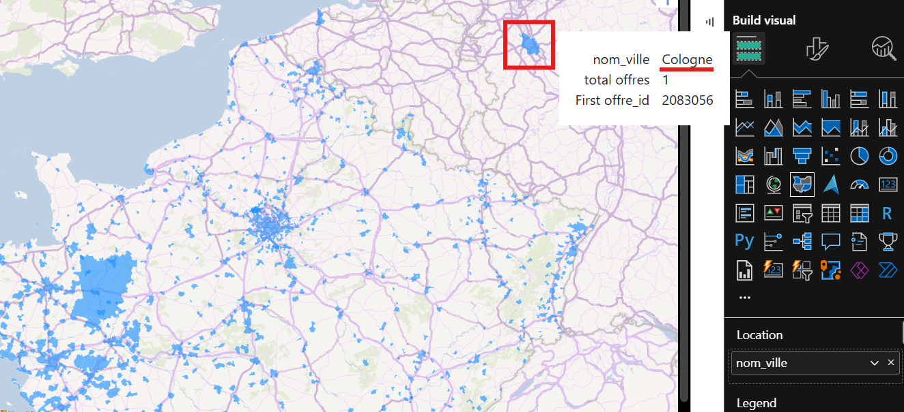
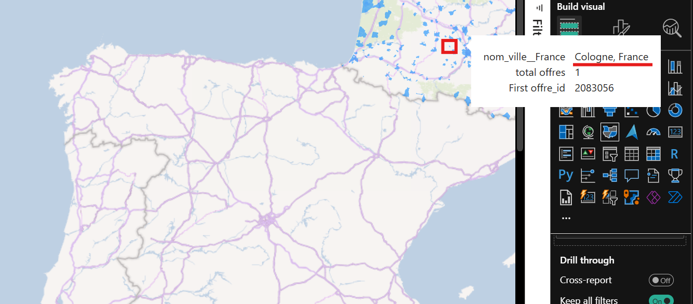

Ce document retrace ce qui a été fait depuis Power BI :

# Quelques notes pour comprendre comment créer le projet from scratch :

- cf https://learn.microsoft.com/fr-fr/power-query/connectors/postgresql

- `Blank report`

- `Get data` > `PostgreSQL database` > `connect`

  - fenêtre "PostgreSQL database" :
    - Server : localhost
    - Database : francetravail
    - Data Connectivity mode : Import
      - Notes :
        - Import → Charge toutes les données en mémoire de Power BI.
        - DirectQuery → Interroge PostgreSQL en temps réel sans stocker les données localement.
    - Advanced options : pas touché

  - fenêtre "localhost;francetravail" :
    - User name : mhh
    - Password : mhh
    - Select which level to apply these settings to : localhost

  - fenêtre "Encryption Support" :

    - We were unable to connect to the data source using an encrypted connection. To access this data source using an unencrypted connection, click OK.

      - On valide "OK".

  - fenêtre "Navigator", où on peut sélectionner les 19 tables.

    - On sélectionne tout, puis "Load".

      - fenêtre "Processing Queries" (Determining automatic transformations...)

        - On peut "Skip", ce qu'on va faire après une dizaine de minutes, car ça bloque sur la table "formation" (pourtant, toutes les autres tables sont bien validées, et j'arrive bien à voir le contenu de la table "formation" par une requête sql)

        - Note : on n'a pas cette fenêtre la deuxième fois (Power BI avait crashé quand j'ai voulu sauvegardé la première fois)

          - fenêtre "Load" (qui finit par bien aboutir)

# Model view

- Onglet "model view" : on voit bien les 19 tables, on doit refaire les liens créés automatiquement.

  - On procède comme le diagramme UML qu'on a défini (voir "load_sql/UML.drawio")

# Transformations sur Power BI

## Avoir une variable "nom_ville, France"

Dans le "report view" / carte mondiale, on a des villes françaises qui sont situés dans d'autres pays, par exemple :

  - offre_id = '2083056' dans la ville "Cologne" (code postal 32 430) en région Occitanie, département Gers  => placé en Allemagne (NOK, car on est censé avoir que des offres en France)

    

  - offre_id = '2757953' dans la ville "La Réunion" (code postal 47700) en région Nouvelle-Aquitaine, département Lot-et-Garonne  => placé en France (OK)

    

Comme vu dans le dernier screenshot, pour avoir les villes placées en France, on définit une colonne "nom_ville__France" avec le nom de la ville suffixé avec `, France` (par exemple "Cologne, France").

# pb avec certaines régions non reconnues ?