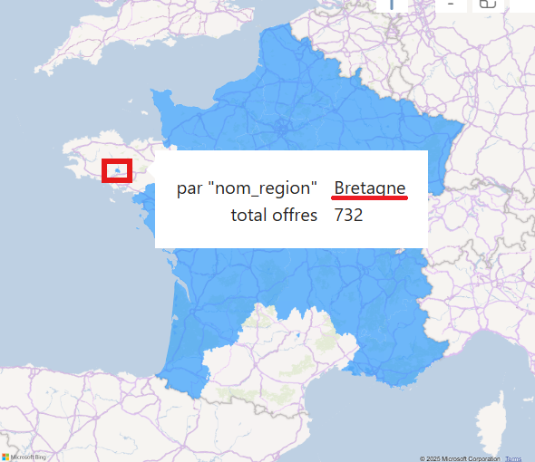

Ce document retrace ce qui a été fait depuis Power BI :

# Connexion avec la base de données

- cf https://learn.microsoft.com/fr-fr/power-query/connectors/postgresql

- `Blank report`

- `Get data` > `PostgreSQL database` > `connect`

  - fenêtre "PostgreSQL database" :
    - Server : localhost
    - Database : francetravail
    - Data Connectivity mode : Import
      - Notes :
        - Import → Charge toutes les données en mémoire de Power BI.
        - DirectQuery → Interroge PostgreSQL en temps réel sans stocker les données localement.
    - Advanced options : pas touché

  - fenêtre "localhost;francetravail" :
    - User name : mhh
    - Password : mhh
    - Select which level to apply these settings to : localhost

  - fenêtre "Encryption Support" :

    - We were unable to connect to the data source using an encrypted connection. To access this data source using an unencrypted connection, click OK.

      - On valide "OK".

  - fenêtre "Navigator", où on peut sélectionner les 19 tables.

    - On sélectionne tout, puis "Load".

      - fenêtre "Processing Queries" (Determining automatic transformations...)

        - On peut "Skip", ce qu'on va faire après une dizaine de minutes, car ça bloque sur la table "formation" (pourtant, toutes les autres tables sont bien validées, et j'arrive bien à voir le contenu de la table "formation" par une requête sql)

        - Note : on n'a pas cette fenêtre la deuxième fois (Power BI avait crashé quand j'ai voulu sauvegardé la première fois)

          - fenêtre "Load" (qui finit par bien aboutir)

# Model view

- Onglet "model view" : on voit bien les 19 tables, on doit refaire les liens créés automatiquement.

  - On procède comme le diagramme UML qu'on a défini (voir "load_sql/UML.drawio")

- On masque les colonnes non utilisées.

- Paramétrer "Cross-filter direction = Both" pour certains liens est nécessaire pour la data viz.

# Table view

Création table de date

Création de colonnes :
  - Date Différence = DATEDIFF('Offre Emploi'[Date Création], 'Offre Emploi'[Date Actualisation], DAY)

# Transformations sur Power BI

## Renommage de toutes les colonnes

C'est juste pour Power BI.

On renommera les colonnes avoir des noms plus facile à lire dans les rapports comme :

- "Offre ID" (au lieu de "offre_id")
- "Durée Travail Libellé" (au lieu de "duree_travail_libelle")

## Ajout de variables avec le nom des villes, départements et région modifiés pour la data viz

### Ajout d'une variable "Nom Ville Modifié"

Dans le "report view" / carte mondiale, on a des villes françaises qui sont situés dans d'autres pays, par exemple :

  - offre_id = '2083056' dans la ville "Cologne" (code postal 32 430) en région Occitanie, département Gers  => placé en Allemagne (NOK, car on est censé avoir que des offres en France)

    

  - offre_id = '2757953' dans la ville "La Réunion" (code postal 47700) en région Nouvelle-Aquitaine, département Lot-et-Garonne  => placé en France (OK)

    

Comme vu dans le dernier screenshot, pour avoir les villes placées en France, on définit une colonne "Nom Ville Modifié" avec le nom de la ville suffixé avec `, France` (par exemple "Cologne, France").

### Ajout d'une variable "Nom Département Modifié"

Même chose pour le département de la "Lot" qui est placé en Lituanie, on ajoute une colonne qui suffixera le nom du département avec `, France` :

  - Département "Lot" en Lituanie :

    

  - Département "Lot" en France :

    

### Ajout d'une variable "Nom Région Modifié"

Quand on affiche la carte du monde avec les régions de la France, on constate que 2 régions (la Bretagne et l'Occitanie) ne sont pas complètement coloriées comme les autres régions :

  - pour la Bretagne :

    

  - pour l'Occitanie :

    

Changer le "Data category" (à "County" ou "State or Province") résout le problème pour l'Occitanie mais pas la Bretagne.

Le contournement est d'ajouter une colonne, où on préfixera le nom de la région de `Région d('|de|du|des)` en fonction des régions, par exemple :

  - "Région d'Île-de-France"
  - "Région de Normandie"
  - "Région des Hauts-de-France"
  - "Région du Grand Est"

A noter qu'il y a une exception pour "Région Bourgogne-Franche-Comté" (pas de `de`).

Cela résout bien le problème de colorisation :

  - pour la Bretagne :

    

  - pour l'Occitanie :

    

