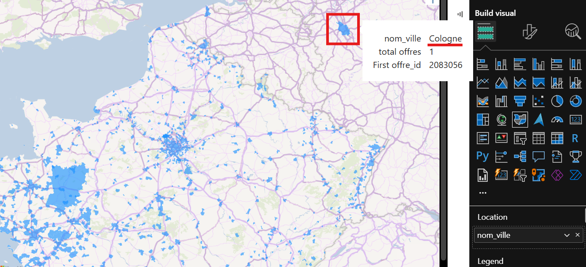

# README secondaire

- Cette page donne des détails complémentaires à la [page principale](../README.md#présentation-du-projet).

- Le sommaire de cette page est aligné à celui de la page principale ([ici](../README.md#sommaire)), à savoir (avec les sous-sections principales) :

  - [1. Environnement](#1-Environnement)
    - [Utilisation de Docker CE dans WSL pour cAdvisor](#utilisation-de-docker-ce-dans-wsl-pour-cadvisor)
    - [Services Docker](#services-docker)
  - [2. ETL avec Airflow](#2-etl-avec-airflow)
    - [Transformations des données](Transformations-des-données)
    - [Chargement des données dans une base de données relationnelle](#chargement-des-données-dans-une-base-de-données-relationnelle)
    - [Airflow](#airflow)
  - [4. Data Viz avec Power BI](#4-Data-Viz-avec-Power-BI)
  - [5. Monitoring avec Prometheus et Grafana](#5-monitoring-avec-prometheus-et-grafana)
    - [Prometheus](#Prometheus)
    - [Grafana](#Grafana)


# 1. Environnement

## Utilisation de Docker CE dans WSL pour cAdvisor

- Sur `Windows 11` et `WSL2` avec `Ubuntu 22.04`, pour que `cAdvisor` soit fonctionnel, il faut :

  - Activer `docker CE` sur WSL :
    - la procédure est décrite [ici](#Installer-et-utiliser-Docker-CE-dans-WSL).

  - Désactiver `Docker Desktop` :
    - dans la GUI : aller dans `Settings` > `Resources` > `WSL Integration`, et décocher `Enable integration with my default WSL distro` et tout autre case cochée concernant `Ubuntu-22.04`.


### Pourquoi utiliser Docker CE

- C'est pour avoir nativement un environnement Docker pur Linux, contrôlé par `systemd` et donc compatible avec `cAdvisor`.

- En effet, `cAdvisor` a notamment besoin pour fonctionner d'avoir accès à `/var/lib/docker/image/overlay2/layerdb/mounts/<conteneur_id>/mount-id`, sinon on a le problème décrit [ici](#Problème-avec-Docker-Desktop).
  - Ce dossier existe nativement avec `Docker CE`.
  - Ce dossier n'existe pas avec `Docker Destop` (si un dossier équivalent existait, on aurait pu faire un montage, mais ce n'est pas le cas sur `Ubuntu 22.04`).


### Problème avec Docker Desktop

- En utilisant `Docker Desktop` uniquement, tous les services Docker du projet sont fonctionnels sauf `cAdvisor`, qui affichent notamment les logs d'erreur suivants au démarrage :

```bash
  docker logs cadvisor
  ##==> ...
  ##==> E0709 23:59:51.210495       1 manager.go:1116] Failed to create existing container: /docker/5d59c6de7d670a827e0eec5751c77dbb805be1deacdde52fbdcd323a4360e6a8: failed to identify the read-write layer ID for container "5d59c6de7d670a827e0eec5751c77dbb805be1deacdde52fbdcd323a4360e6a8". - open /rootfs/var/lib/docker/image/overlayfs/layerdb/mounts/5d59c6de7d670a827e0eec5751c77dbb805be1deacdde52fbdcd323a4360e6a8/mount-id: no such file or directory
  ##==> E0709 23:59:51.237487       1 manager.go:1116] Failed to create existing container: /docker/3567368bffadb8d183ad3cd8cfc57e5cf9c8cde98853389d5ac7b05959b98ec7: failed to identify the read-write layer ID for container "3567368bffadb8d183ad3cd8cfc57e5cf9c8cde98853389d5ac7b05959b98ec7". - open /rootfs/var/lib/docker/image/overlayfs/layerdb/mounts/3567368bffadb8d183ad3cd8cfc57e5cf9c8cde98853389d5ac7b05959b98ec7/mount-id: no such file or directory
  ##==> ...
```

  - L'erreur `open /rootfs/var/lib/docker/image/overlayfs/layerdb/mounts/<conteneur_id>/mount-id: no such file or directory` avec `Docker Desktop` est connue et remontée à travers ce ticket : https://github.com/vacp2p/wakurtosis/issues/58.

    - Pour le contourner, certaines forums proposent de faire un montage sur `\\wsl$\docker-desktop-data\data\docker` mais ce dossier n'existe pas sur la distribution `Ubuntu 22.04`, et faire un montage avec le dossier existant `\\wsl.localhost\docker-desktop\mnt\docker-desktop-disk\data\docker` ne fonctionne pas non plus car il n'y a pas le fichier `mount-id`.

- La section [suivante](#Installer-et-utiliser-Docker-CE-dans-WSL) présente la procédure complète pour installer `Docker CE` dans `WSL2 Ubuntu 22.04` avec `systemd`.


### Installer et utiliser Docker CE dans WSL

1. Activer `systemd` dans `WSL2`, puis redémarrer WSL avec PowerShell :

```bash
  vi /etc/wsl.conf
  ##==> [boot]
  ##==> systemd=true
  ```
```powershell
  wsl --shutdown  # avec powershell
  ```

2. Vérifier que `systemd` fonctionne :

```bash
  systemctl --no-pager status user.slice
  ##==> ● user.slice - User and Session Slice
  ##==>      Loaded: loaded (/lib/systemd/system/user.slice; static)
  ##==>      Active: active since Thu 2025-07-10 08:44:30 CEST; 1h 13min ago      <== systemd est "actif"
  ##==>        ...
  ```

3. Installer Docker CE :

```bash
  # Installer les dépendances
  sudo apt update
  sudo apt install apt-transport-https ca-certificates curl gnupg lsb-release software-properties-common -y

  # Ajouter la clé GPG officielle et le dépôt Docker
  curl -fsSL https://download.docker.com/linux/ubuntu/gpg | sudo gpg --dearmor -o /etc/apt/keyrings/docker.gpg
  echo \
    "deb [arch=$(dpkg --print-architecture) signed-by=/etc/apt/keyrings/docker.gpg] \
    https://download.docker.com/linux/ubuntu \
    $(. /etc/os-release && echo $VERSION_CODENAME) stable" | \
    sudo tee /etc/apt/sources.list.d/docker.list

  # Mettre à jour et installer
  sudo apt update
  sudo apt install docker-ce docker-ce-cli containerd.io docker-buildx-plugin docker-compose-plugin -y
```

4. Corriger iptables pour une compatibilité avec WSL2 afin de permettre à Docker de démarrer correctement :

```bash
  # Ubuntu 22.04 utilise `nftables` par défaut, incompatible avec Docker sur WSL2, il faut basculer vers l'option `legacy` :
  sudo update-alternatives --set iptables /usr/sbin/iptables-legacy
  sudo update-alternatives --set ip6tables /usr/sbin/ip6tables-legacy
  ##==> update-alternatives: using /usr/sbin/iptables-legacy to provide /usr/sbin/iptables (iptables) in manual mode
  ##==> update-alternatives: using /usr/sbin/ip6tables-legacy to provide /usr/sbin/ip6tables (ip6tables) in manual mode
```

5. Configuration de l'utilisateur :

```bash
  # Ajouter l'utilisateur au groupe docker
  sudo usermod -aG docker $USER
  ```

```powershell
  wsl --shutdown  # avec powershell
  ```

6. Activer et démarrer Docker au démarrage :

```bash
  # Activer le service Docker
  sudo systemctl enable docker.service
  ##==> Synchronizing state of docker.service with SysV service script with /lib/systemd/systemd-sysv-install.
  ##==> Executing: /lib/systemd/systemd-sysv-install enable docker

  # Vérifier le statut
  systemctl status docker.service
    ##==> ● docker.service - Docker Application Container Engine
    ##==>      Loaded: loaded (/lib/systemd/system/docker.service; enabled; vendor preset: enabled)
    ##==>      Active: active (running) since Thu 2025-07-10 10:07:48 CEST; 1min 18s ago             <== c'est bon
    ##==>        ...
```

7. Désactiver la variable `DOCKER_HOST`, souvent utilisée pour pointer vers `Docker Desktop` :

```bash
  env | grep -i DOCKER_HOST
  # il faut qu'il n'y ait rien de retourner
```

Si une ligne comme `DOCKER_HOST=tcp://localhost:2375` s'affiche, alors il faut faire `unset DOCKER_HOST`.


## Services Docker

### Récupération des versions

Cette section montre les commandes pour retrouver les versions des différents services.

```bash
  docker images --digests
    ##==> REPOSITORY                         TAG         DIGEST                                                                    IMAGE ID       CREATED        SIZE
    ##==> job_market-fastapi                 latest      sha256:00ce6647228ecf84b430f2f9cacc8e17a8b420c3472c766ce7bf5480a93fe755   00ce6647228e   38 hours ago   433MB
    ##==> job_market-airflow-dag-processor   latest      sha256:a20386275c72f7ec18ecf90296ae4b6a5dac204d44f79f011f70a5699e9e15e3   a20386275c72   41 hours ago   2.8GB
    ##==> job_market-airflow-apiserver       latest      sha256:47c2d256a4749916d431f38e9cb644f17ec2fd7ddd340deac0af8b9e80fd7f78   47c2d256a474   41 hours ago   2.8GB
    ##==> job_market-airflow-triggerer       latest      sha256:1a85ae5afaeec22176a9cb572600684828b5f09f5928d8b316d99dfb08125a26   1a85ae5afaee   41 hours ago   2.8GB
    ##==> job_market-airflow-scheduler       latest      sha256:e76c44a0985c768a7cfa86463312e3310b203633c7130e038ca9b271e43502ab   e76c44a0985c   41 hours ago   2.8GB
    ##==> job_market-airflow-init            latest      sha256:356a9139712c224953130572a0cc66d18ea93c3552539cc78928f8ab80350c28   356a9139712c   41 hours ago   2.8GB
    ##==> job_market-airflow-worker          latest      sha256:f44d36bb3b6fdc2d2b25b9bb6f3bef26c3d0cdf4d547ae73d575a12aafe6f8d5   f44d36bb3b6f   41 hours ago   2.8GB
    ##==> prom/prometheus                    latest      sha256:7a34573f0b9c952286b33d537f233cd5b708e12263733aa646e50c33f598f16c   7a34573f0b9c   6 days ago     382MB
    ##==> postgres                           16-alpine   sha256:ef2235fd13b6cb29728a98ee17862ff5c9b7d20515a9b34804da4a45062695f6   ef2235fd13b6   4 weeks ago    394MB
    ##==> redis                              latest      sha256:b43d2dcbbdb1f9e1582e3a0f37e53bf79038522ccffb56a25858969d7a9b6c11   b43d2dcbbdb1   5 weeks ago    188MB
    ##==> prom/statsd-exporter               latest      sha256:4e7a1f00b9b23ef0c5b4fdbb7f4748bdc218cfdff04acc8033bc5b9f7c15009d   4e7a1f00b9b2   8 months ago   33.4MB


  # FastAPI
  docker exec -it fastapi pip show fastapi
    ##==> Name: fastapi
    ##==> Version: 0.115.12
    ##==> ...

  # Postgres
  docker exec -it postgres postgres --version
    ##==> postgres (PostgreSQL) 16.9

  # Redis
  docker exec -it redis redis-server --version
    ##==> Redis server v=8.0.3 sha=00000000:1 malloc=jemalloc-5.3.0 bits=64 build=680cac7fe8eb957c

  # Airflow
  # 3.0.3 (défini dans "airflow/Dockerfile")

  # Statsd-exporter
  docker run --rm --entrypoint statsd_exporter prom/statsd-exporter --version
    ##==> statsd_exporter, version 0.28.0 (branch: HEAD, revision: c0a390a2c43f77863278615b47d46e886bdca726)
    ##==>   build user:       root@783240c1e627
    ##==>   build date:       20241025-13:53:47
    ##==>   ...

  # Node-exporter
  docker exec node-exporter node_exporter --version
    ##==> node_exporter, version 1.9.1 (branch: HEAD, revision: f2ec547b49af53815038a50265aa2adcd1275959)
    ##==>   build user:       root@7023beaa563a
    ##==>   build date:       20250401-15:19:01
    ##==>   ...

  # Postgres-exporter
  docker exec postgres-exporter postgres_exporter --version
  ##==> postgres_exporter, version 0.17.1 (branch: HEAD, revision: 1e574cf4fd2a75a8a707d424eafcaa0b88cb7af4)
  ##==>   build user:       root@b0ba132eddb0
  ##==>   build date:       20250226-13:53:15
  ##==>   ...

  # cAdvisor
  docker exec cadvisor /usr/bin/cadvisor --version
  ##==> cAdvisor version v0.49.1 (6f3f25ba)

  # Prometheus
  docker exec -it prometheus prometheus --version
    ##==> prometheus, version 3.5.0 (branch: HEAD, revision: 8be3a9560fbdd18a94dedec4b747c35178177202)
    ##==>   build user:       root@4451b64cb451
    ##==>   build date:       20250714-16:15:23
    ##==>   ...

  # Grafana
  docker exec -it grafana grafana server -v
    ##==> Version 12.0.2 (commit: 5bda17e7c1cb313eb96266f2fdda73a6b35c3977, branch: HEAD)
```


# 2. ETL avec Airflow

## Transformations des données

### Transformations des données en amont (côté Python)

#### Conservation des offres en France Métropolitaine uniquement

- On va dans ce projet se focaliser sur les offres en France Métropolitaine.

  - Pour supprimer les offres en dehors de la métropôle, on se basera sur le numéro du département, qui est à 3 chiffres pour les DOM-TOM, et égales à `2A` ou `2B` pour la Corse.

    - Dans ce cas, on supprimera les offres en DOM-TOM et en Corse avec la regex `^(\d{3}|2(A|B))\s-\s`.

  - L'attribut `libelle` donne l'information lorsque qu'une offre se retrouve dans le `cas_3` (voir partie ci-dessous), c'est-à-dire lorsque `libelle` est de la forme "<département> - <nom_du_département>", par exemple : `971 - Guadeloupe`, `974 - Réunion`, `2A - Corse du Sud`, `2B - BASTIA`.


#### Attributs de localisation des offres (noms et codes des villes, communes, départements et régions)

- Le screenshot suivant (issu du fichier `step_1__location_cases.xlsx`) résume la partie décrite ci-dessous :

  

- Le fichier `airflow/data/resources/code_name__city_department_region.csv` :

  - a été généré à partir de 4 fichiers récupérés sur le site de l'insee et sur data.gouv :

    - `v_commune_2024.csv`, `v_departement_2024.csv` et `v_region_2024.csv` (https://www.insee.fr/fr/information/7766585)
    - `cities.csv` (https://www.data.gouv.fr/fr/datasets/villes-de-france/)

  - donne le mapping entre :

    - `code_insee` et `nom_commune`
    - `code_postal` et `nom_ville`
    - `code_departement` et `nom_departement`
    - `code_region` et `nom_region`

  - permet de catégoriser les cas décrits ci-après, et ainsi récupérer les attributs `nom_ville`, `nom_commune`, `code_departement`, `nom_departement`, `code_region`, `nom_region`.


- Pour les offres récupérées, l'attribut `lieuTravail` peut renseigner les champs suivants `libelle`, `latitude`, `longitude`, `code_postal` et `code_insee`.

  - Ces champs peuvent permettre de retrouver la ville, le département et/ou la région d'une offre d'emploi.


- Dans les cas décrits par la suite, on part du cas le plus favorable au cas le plus défavorable.

- Pour exemple, les cas suivants donneront une idée de pourcentage d'offres pour chacun des cas, à partir du json suivant : `_archives/1--generated_json_file/2025-03-02--18h36__extraction_occurence_1.json` qui contient 13 639 offres.


- Pour catégoriser les offres, on va écrire pour chacune des offres si elle est dans le `cas_1`, dans le `cas_2`, etc... dans une colonne dédiée (`lieu_cas`).


##### Cas_1 : "code_insee" renseigné

- Dans ce cas, on peut récupérer la ville, le département, et la région.

  - Sur le json archivé, c'est le cas pour 12 118 offres sur 13 639, soit 88.85% des offres.

- Notes :
  - dans ce cas, il se peut que `code_postal` ne soit pas renseigné
  - si `code_insee = NAN`, alors `code_postal = NAN` aussi (donc la colonne code_postal n'est pas utile pour retrouver la ville)


###### Ajout des attributs de localisation

- On a donc le code commune.
- A partir du fichier `codes_city_department_region_names.csv`, on ajoute la ville, le département, et la région.


##### Cas_2 : "code_insee = NAN" (dans ce cas "code_postal = NAN"), mais coordonnées GPS renseignées

- Dans ce cas, on peut récupérer la ville, le département, et la région.

  - Sur le json archivé, c'est le cas pour 191 offres sur 13 639, soit 1.40% des offres.

- Ici, il y a 2 sous-cas :
  - soit les coordonnées GPS sont corrects,
  - soit la valeur de la latitude et la valeur de la longitude sont inversées.

- On va se baser sur https://fr.wikipedia.org/wiki/Liste_de_points_extr%C3%AAmes_de_la_France pour trouver les variations des coordonnées GPS en France Métropolitaine.

- En effet :
  - le point le plus au nord : (51° 05′ 21″ N, 2° 32′ 43″ E)
  - le point le plus au sud : (42° 19′ 58″ N, 2° 31′ 58″ E)
  - le point le plus à l'est : (48° 58′ 02″ N, 8° 13′ 50″ E)
  - le point le plus à l'ouest : (48° 24′ 46″ N, 4° 47′ 44″ O)


- En convertissant ces coordonnées en valeur décimale, on trouve les fourchettes suivantes pour la latitude et la longitude de la France Métropolitaine :

  - Latitude : 42,3328 (Sud) -> 51,0892 (Nord)
  - Longitude : -4,7956 (Ouest) -> 8,2306 (Est)


- Pour vérifier si la latitude a été inversée avec la longitude :
  - on vérifie si la latitude renseignée est bien comprise entre 42.3328 et 51.0892,
    - si oui, ça correspond à une latitude de la France Métropolitaine,
    - si non, on vérifie que la valeur renseignée pour la longitude l'est bien
      - si oui, on inversera la valeur de la latitude avec la valeur de la longitude.


###### Ajout des attributs de localisation

- La librairie `geopy` permet de retrouver plusieurs informations (`city`, `city_district`, `postcode`, `suburb`, `municipality`, `state`, `town`...), mais tous ces attributs ne sont pas toujours disponibles...
  - En revanche, l'information qui semble toujours être retourné est le code postal.

- A partir du code postal, on ajoute la ville, le département et la région.


- Parfois le code postal retourné par geopy n'est pas présent dans le fichier `code_name__city_department_region.csv` (et donc non présent dans https://www.data.gouv.fr/fr/datasets/villes-de-france/, ni sur https://www.data.gouv.fr/fr/datasets/base-officielle-des-codes-postaux/).

  - Par exemple, sur le json archivé, c'est le cas pour 4 offres où geopy renvoit les codes postaux "34009", "06205", "57045", "13030".

  - Dans ce cas, on va prendre les 2 premiers digits du code postal pour avoir le département, et récupérer la région.


- Notes :

  - C'est assez long (~5 minutes pour 191 offres) car la méthode `geolocator.reverse()` fait une requête http pour chaque offre.

  - Geopy retourne un code postal, mais ce code postal peut être associé à plusieurs villes.
    - Par conséquent, si une offre renseigne le code postal 78310, elle peut être soit à Coignières soit à Maurepas, qui partagent le même code postal, ce qu'on ne peut pas deviner.
    - Cela ne pose pas vraiment problème, étant donné qu'en général plusieurs villes qui ont le même code postal sont relativement proches/voisines.


##### Cas_3 : "code_postal = code_insee = latitude = longitude = NAN", mais "libelle = 'numéro_département - nom_département'"

- Dans ce cas, on ne peut pas retrouver la ville, mais on peut retrouver le département, et par conséquent la région.

  - Sur le json archivé, c'est le cas pour 804 offres sur 13 639, soit 5.89% des offres.


###### Ajout des attributs de localisation

- Dans ce cas, on a par exemple `libelle = 75 - Paris (Dept.)`, donc on va extraire le code du département dans la colonne `code_departement`, et récupérer `nom_departement`, `code_region` et `nom_region` à partir du fichier `code_name__city_department_region.csv`.


##### Cas_4 : "code_postal = code_insee = latitude = longitude = NAN", mais "libelle = nom_région"

- Dans ce cas, on a que la région, et on ne peut donc pas avoir la ville ni le département.

  - Sur le json archivé, c'est le cas pour 54 offres sur 13 639, soit 0.39% des offres.


- A noter que le nom de la région n'est pas toujours homogène, par exemple, on peut avoir "Ile-de-France" et "Île-de-France" (i avec ou sans accent circonflexe), ce qui est traité dans le script.


###### Ajout des attributs de localisation

Dans ce cas, on écrira `code_region` et `nom_region` à partir du fichier `code_name__city_department_region.csv`.


##### Cas_5 : "code_postal = code_insee = latitude = longitude = NAN", et "libelle = ("FRANCE"|"France"|"France entière")"

- C'est le cas le plus défavorable qui ne permet pas de retrouver la ville, le département ni la région.

  - Sur le json archivé, c'est le cas pour 252 offres sur 13 639, soit 1.85% des offres.


- On pourrait aller plus loin, et tenter de retrouver l'information dans l'intitulé ou la description de l'offre d'emploi, mais on ne le fera pas ici.


### Transformations des données en aval (côté SQL)

#### Attribut "metier_data"

- Pour identifier les offres de "Data Engineer" parmi toutes les offres récupérées, le premier réflexe serait de filtrer sur le rome_code `M1811` qui correspond à `Data engineer`, mais on se rend compte que les offres d'emploi associées ne sont pas toutes liées à ce poste.

- On retrouve en effet des postes d'architecte, d'ingénieur base de données, de data analyst, de data manager, de technicien data center, etc... (voir résultats de la requête `fastapi/sql_requests/10_table_DescriptionOffre/not_used_on_fastapi/3__rome_M1811.pgsql`).


- L'attribut `intitule_offre` de la table `DescriptionOffre` sera donc utilisé pour filtrer les offres voulues (ici : `Data Engineer`, `Data Analyst` et `Data Scientist`) grâce à des requêtes qui utilisent des regex, écrivant la valeur `DE`, `DA`, `DS` dans l'attribut `metier_data` (voir `airflow/dags/sql`).


#### Attributs "salaire_min" et "salaire_max"

##### Contexte

- Pour écrire ces attributs qui donnent les salaires minimum et maximum annuels, on se base sur l'attribut `salaire_libelle`, qui n'est pas toujours renseigné.

- Lorsqu'elle l'est, les valeurs pour cet attribut sont parfois mal renseignées par les recruteurs :

  - qui inversent parfois le salaire annuel avec le salaire mensuel [auquel cas on fera un traitement (voir ci-dessous) pour avoir les bons salaires] :

    - `Annuel de 486,00 Euros à 1801,00 Euros` (c'est sûrement un salaire mensuel et non annuel)
    - `Mensuel de 32000,00 Euros à 40000,00 Euros` (c'est sûrement un salaire annuel et non mensuel)

  - qui inversent les salaires min et max [auquel cas on les inversera] :

    - `Annuel de 60000,00 Euros à 40000,00 Euros`

  - qui se trompent sûrement dans les salaires renseignés :

    - `Autre de 30000,00 Euros à 400000,00 Euros` (salaire max = 400k : sûrement erroné avec un 0 en trop)
    - `Annuel de 80000,00 Euros à 850000,00 Euros` (idem avec salaire max = 850k)
    - `Annuel de 550000.0 Euros sur 12.0 mois` (salaire = 550k : sûrement erroné avec un 0 en trop)


- D'autre part, il faut noter que beaucoup d'offres ne renseignent que le taux horaire [auquel cas on écrira null], par exemple :

  - `Annuel de 11,00 Euros` (c'est sûrement un taux horaire)
  - `Horaire de 11.88 Euros sur 12 mois`


##### Hypothèses

- Comme on n'est pas certain si les salaires indiqués sont mensuels ou annuels (à cause des erreurs des recruteurs), on va prendre les hypothèses suivantes :
  - salaire mensuel ∈ [1 666, 12 500]
  - salaire annuel ∈ [20 000, 150 000]

- Donc, on considère que si salaire mensuel :
  - inférieur à 1666 € (20k), ce n'est pas un salaire mensuel (pour écarter les taux horaires, les salaires à mi-temps, les salaires en alternance...)
  - supérieur à 12 500 € (150k), c'est très certainement une faute de frappe (il y a vraiment très peu d'offres dans ce cas, peut-être 4 pour 13k offres)

    - par exemple :

      - Ingénieur systèmes embarqués (H/F) : `Annuel de 80000,00 Euros à 850000,00 Euros` (80k - 850k)
      - Administrateur Bases de données - DBA / Microsoft SQL Server(H/F) (H/F)	: `Mensuel de 400000.0 Euros à 450000.0 Euros sur 12.0 mois` (400k - 450k)
	    - Chef de Projet EDI (H/F) : `Annuel de 50000.0 Euros à 540000.0 Euros sur 12.0 mois` (50k - 540k)
      - Data Analyst H/F: `Annuel de 45000,00 Euros à 550000,00 Euros` (45k - 550k)


##### Algorithme

- Pour les transformations, on va considérer les cas suivants.

- Si "salaire_libelle" donne :

  - A. une fourchette de salaire ("cas fourchette") :

    - `Annuel de 60000.0 Euros à 90000.0 Euros`
    - `Annuel de 60000.0 Euros à 90000.0 Euros sur 12.0 mois`
    - `Annuel de 60000.0 Euros à 90000.0 Euros sur 13.0 mois`
    - `Mensuel de 1767.00 Euros à 2600.00 Euros sur 12 mois`
    - `Mensuel de 1767.00 Euros à 2600.00 Euros`
    - `Autre de 1910,00 Euros à 2050,00 Euros`
    - `De 40000,00 Euros à 40000,00 Euros`
    - `Autre de 40000,00 Euros à 45000,00 Euros`
    - `Cachet de 50000,00 Euros à 55000,00 Euros`


      - cas 1 : Si salaire minimum récupéré > salaire maximal récupéré *ET* salaires min+max récupérés ∈ [1 666 €, 12 500 €] (on considère que c'est un salaire mensuel)
        - alors on inverse les salaires mensuels minimum et maximum.

          - exemple :
            - `Mensuel de 5500.0 Euros à 4200.0 Euros sur 12.0 mois`


      - cas 2 : Si salaires min+max récupérés ∈ [1 666 €, 12 500 €] (on considère que c'est un salaire mensuel)
        - alors on récupère les salaires minimum et maximum et on les multiplie par 12.

          - exemples :
            - `Annuel de 1800,00 Euros à 2000,00 Euros`
            - `Mensuel de 2900,00 Euros à 3000,00 Euros`
            - `Autre de 1855,26 Euros à 1855,26 Euros`


      - cas 3 : Si salaire minimum récupéré > salaire maximal récupéré *ET* salaires min+max récupérés ∈ [20 000 €, 150 000 €] (on considère que c'est un salaire annuel)
        - alors on inverse les salaires annuels minimum et maximum.

          - exemple :
            - `Annuel de 60000,00 Euros à 40000,00 Euros`


      - cas 4 : Si salaires min+max récupérés ∈ [20 000 €, 150 000 €] (on considère que c'est un salaire annuel)
        - alors on récupère les salaires minimum et maximum.

          - exemples :
            - `Annuel de 55000,00 Euros à 65000,00 Euros`
            - `Mensuel de 45000.0 Euros à 50000.0 Euros sur 12.0 mois`
            - `Autre de 45000,00 Euros à 55000,00 Euros`


      - cas 5 : Sinon, dans les autres cas
          - alors salaire min/max = NULL.

            - exemples où `salaire minimum <= 1 666 €` :
              - `Annuel de 25,00 Euros à 30,00 Euros`
              - `Mensuel de 850,00 Euros à 950,00 Euros`
              - `De 13,00 Euros à 14,00 Euros`

            - exemples où `salaire max >= 150 000 €` :
              - `Annuel de 80000,00 Euros à 850000,00 Euros`
              - `Mensuel de 400000.0 Euros à 450000.0 Euros sur 12.0 mois`
              - `Autre de 30000,00 Euros à 400000,00 Euros`

            - exemple où `salaire n'appartient pas aux fourchettes de salaires mensuels [1 666, 12 500] ni annuels [20 000, 150 000]` :

              - `Annuel de 19000,00 Euros à 19000,00 Euros`


  - B. un salaire unique ("cas salaire unique") :

    - `Annuel de 48000.0 Euros sur 12.0 mois`
    - `Annuel de 50000,00 Euros`
    - `Mensuel de 45000.0 Euros sur 12.0 mois`


      - cas 2 : Si salaire récupéré ∈ [1 666 €, 12 500 €] (on considère que c'est un salaire mensuel)
        - alors on récupère le salaire et on le multiplie par 12.

          - exemples :
            - `Mensuel de 4410,00 Euros`


      - cas 4 : Si salaire récupéré ∈ [20 000 €, 150 000 €] (on considère que c'est un salaire annuel)
        - alors on récupère le salaire.

          - exemples :
            - `Annuel de 55000.0 Euros sur 12.0 mois`


      - cas 5 : Sinon, dans les autres cas
        - alors salaire min/max = NULL.

          - exemples :
            - `Annuel de 1000,00 Euros`
            - `Mensuel de 12,00 Euros`
            - `Annuel de 550000.0 Euros sur 12.0 mois`


##### Exemples d'offres réelles avec les salaires qu'on fixe


| offre_id | intitule_offre                         | salaire_libelle                              | get_salaire_min | get_salaire_max | cas                | sous-cas                                    | salaire_min | salaire_max |
| -------- | -------------------------------------- | -------------------------------------------- | --------------- | --------------- | ------------------ | ------------------------------------------- | ----------- | ----------- |
| -        | -                                      | -                                            | -               | -               | -                  | 1 (min>max + mois ∈ [1 666, 12 500])        | -           | -           |
| 2430874  | Chef de projet (H/F)                   | Mensuel de 5880,00 Euros à 8085,00 Euros     | 5880            | 8085            | cas fourchette     | 2 (mois ∈ [1 666, 12 500])                  | 70560       | 97020       |
| 188TYKG  | MANAGEUR-EUSE DE TRANSITION (H/F)      | Mensuel de 3136.0 Euros sur 12.0 mois        | 3136            | 12              | cas salaire unique | 2 (mois ∈ [1 666, 12 500])                  | 37632       | 37632       |
| 2861769  | Chef de projet (H/F)                   | Annuel de 60000,00 Euros à 40000,00 Euros    | 60000           | 40000           | cas fourchette     | 3 (min>max + an ∈ [20 000, 150 000])        | 40000       | 60000       |
| 2710913  | Responsable BI / Data (H/F)            | Annuel de 75000,00 Euros à 90000,00 Euros    | 75000           | 90000           | cas fourchette     | 4 (an ∈ [20 000, 150 000])                  | 75000       | 90000       |
| 188LKVH  | Technicien d'exploitation informatique | Annuel de 25200.0 Euros sur 12.0 mois        | 25200           | 12              | cas salaire unique | 4 (an ∈ [20 000, 150 000])                  | 25200       | 25200       |
| 6071688  | Management de Projets Numériques H/F   | Mensuel de 850,00 Euros à 950,00 Euros       | 850             | 950             | cas fourchette     | 5 (autres cas : salaire < 1666 €)           | null        | null        |
| 2554957  | Chef de Projet Eds Entrepôt de Données | Annuel de 19000,00 Euros à 19000,00 Euros    | 19000           | 19000           | cas fourchette     | 5 (autres cas : salaire ∈ ]12 500, 20 000[) | null        | null        |
| 2968347  | Gestionnaire ERP (H/F)                 | Mensuel de 352800,00 Euros à 411600,00 Euros | 352800          | 411600          | cas fourchette     | 5 (autres cas : salaire > 150 000 €)        | null        | null        |


- A noter aussi que les salaires des offres en alternance seront exclues ici car leur salaire est très majoritairement inférieur au seuil minimum qu'on a défini ici.


## Chargement des données dans une base de données relationnelle

### Mise à jour de la base de données après récupération de nouvelles offres

#### Evolution de "qualification_code"

- Certaines offres voient la valeur de l'attribut `qualification_code` évoluer, par exemple :

  - `offre_id = 188LLXS` (`intitule = Technicien de gestion de données sur équipement (H/F)`) :
    - lors de `date_extraction = 2025-03-02` : `qualification_code = 7`
    - lors de `date_extraction = 2025-04-05` : `qualification_code = 8`

  - `offre_id = 186XNDD` (`intitule = Coach sportif(ve) (H/F)`) :
    - lors de `date_extraction = 2025-03-02` : `qualification_code = 6`
    - lors de `date_extraction = 2025-04-05` : `qualification_code = 7`


- Avec l'attribut `date_extraction` qui vient de la table `OffreEmploi`, on n'a pas moyen de savoir quelle ligne parmi les suivantes sont les plus récentes, car pour chaque mise à jour, l'attribut `date_extraction` est mis à jour et prend la valeur `2025-04-05`.

  | offre_id | qualification_code | date_extraction |
  | -------- | ------------------ | --------------- |
  | 188LLXS  | 7                  | 2025-04-05      |
  | 188LLXS  | 8                  | 2025-04-05      |
  | 186XNDD  | 6                  | 2025-04-05      |
  | 186XNDD  | 7                  | 2025-04-05      |


- Ce qui nous intéresse est d'avoir la date d'extraction réelle :

  | offre_id | qualification_code | date_extraction |
  | -------- | ------------------ | --------------- |
  | 188LLXS  | 7                  | 2025-03-02      |
  | 188LLXS  | 8                  | 2025-04-05      |
  | 186XNDD  | 6                  | 2025-03-02      |
  | 186XNDD  | 7                  | 2025-04-05      |

pour ne garder que le `qualification_code` le plus récent si 1 offre_id est présente avec 2 qualification_code différents :

  | offre_id | qualification_code | date_extraction |
  | -------- | ------------------ | --------------- |
  | 188LLXS  | 8                  | 2025-04-05      |
  | 186XNDD  | 7                  | 2025-04-05      |


- Il faut donc ajouter `date_extraction` dans la table `offre_qualification`.


#### Evolution de "experienceExige" et "experienceLibelle"

Même problématique avec certaines offres qui voient la valeur de l'attribut `experienceExige` et leur `experienceLibelle` évoluer, par exemple :

  - `offre_id = 1316532` (`intitule = Administrateur linux (H/F)`) :

    - lors de `date_extraction = 2025-03-02` : `experienceExige = E` et `experienceLibelle = Expérience exigée de 3 An(s)` (par exemple `experience_id = 6`)

    - lors de `date_extraction = 2025-04-05` : `experienceExige = D` et `experienceLibelle = Débutant accepté` (par exemple `experience_id = 2`)


### Concaténation spéciale entre le json existant et le nouveau json

- A la fin du `DAG 1`, une concaténation spéciale a lieu entre le json exitant (qu'on appelle `json_A` pour simplifier) et le nouveau json (`json_B`).

- Elle permet de :

  - conserver les offres de `json_A` qui n'existent plus dans `json_B`
    - ce sont les offres d'emploi qui ne sont plus d'actualité

  - mettre à jour les offres avec les valeurs des attributs de `json_A` avec les valeurs de `json_B`,
    - ce sont les offres d'emploi ayant été mises à jour

  - ajouter les offres de `json_B` qui n'étaient pas présentes dans `json_A`
    - ce sont les nouvelles offres


- Cette concaténation spéciale est expliquée/illustrée dans ce fichier `drawio_files/db_update.drawio`.

- En voici un screenshot :

  


## Airflow

### SQLExecuteQueryOperator vs PostgresOperator avec Airflow 3.0

- `PostgresOperator` est deprecated au profil de `SQLExecuteQueryOperator` avec la version `apache-airflow-providers-postgres` utilisée (6.1.3).

- Il faudra donc utiliser `SQLExecuteQueryOperator` pour l'exécution des requêtes SQL.


- En effet, l'erreur :

  ```bash
      from airflow.operators.postgres_operator import PostgresOperator
  ModuleNotFoundError: No module named 'airflow.operators.postgres_operator'
  ```

  est causé par :

    ```python
    from airflow.operators.postgres_operator import PostgresOperator
    ```

Après s'être connecté sur le conteneur `airflow-worker` :

  ```bash
  default@0ab352f980fd:/opt/airflow$ pip list | grep apache-airflow-providers-postgres
  apache-airflow-providers-postgres         6.1.3
  ```

=> https://airflow.apache.org/docs/apache-airflow-providers-postgres/6.1.3/


Change log : https://airflow.apache.org/docs/apache-airflow-providers-postgres/6.2.0/changelog.html#

  ```md
  à partir de la 6.0.0 :
  Remove airflow.providers.postgres.operators.postgres.PostgresOperator. Please use airflow.providers.common.sql.operators.sql.SQLExecuteQueryOperator instead.
  ```

  ```bash
  default@0ab352f980fd:/opt/airflow$ cat /home/airflow/.local/lib/python3.12/site-packages/airflow/providers/common/sql/operators/sql.py  |  grep SQLExecuteQueryOperator
  class SQLExecuteQueryOperator(BaseSQLOperator):
  ```


### Problème d'import du fichier DAG trop lent

- L'erreur suivante avait été remontée car l'import du DAG avait pris plus de 30 secondes :

```log
  Log message source details: sources=["/opt/airflow/logs/dag_id=DAG_1_ETL/run_id=manual__2025-07-07T11:33:42.757187+00:00/task_id=ETL.A1_get_offers/map_index=54/attempt=1.log"]
  [2025-07-07, 13:36:44] INFO - DAG bundles loaded: dags-folder: source="airflow.dag_processing.bundles.manager.DagBundlesManager"
  [2025-07-07, 13:36:44] INFO - Filling up the DagBag from /opt/airflow/dags/dag_1_etl.py: source="airflow.models.dagbag.DagBag"
  [2025-07-07, 13:37:14] ERROR - Process timed out, PID: 1471: source="airflow.utils.timeout.TimeoutPosix"
  [2025-07-07, 13:37:14] ERROR - Failed to import: /opt/airflow/dags/dag_1_etl.py: source="airflow.models.dagbag.DagBag"
  AirflowTaskTimeout: DagBag import timeout for /opt/airflow/dags/dag_1_etl.py after 30.0s.
  Please take a look at these docs to improve your DAG import time:
  * https://airflow.apache.org/docs/apache-airflow/3.0.2/best-practices.html#top-level-python-code
  * https://airflow.apache.org/docs/apache-airflow/3.0.2/best-practices.html#reducing-dag-complexity, PID: 1471
  File "/home/airflow/.local/lib/python3.12/site-packages/airflow/models/dagbag.py", line 394 in parse
  File "<frozen importlib._bootstrap_external>", line 999 in exec_module
  File "<frozen importlib._bootstrap>", line 488 in _call_with_frames_removed
  File "/opt/airflow/dags/dag_1_etl.py", line 1147 in <module>
  File "/home/airflow/.local/lib/python3.12/site-packages/airflow/sdk/bases/decorator.py", line 400 in expand
  File "/home/airflow/.local/lib/python3.12/site-packages/airflow/sdk/bases/decorator.py", line 389 in _validate_arg_names
  File "/home/airflow/.local/lib/python3.12/site-packages/airflow/sdk/bases/decorator.py", line 97 in _validate_arg_names
  File "/home/airflow/.local/lib/python3.12/site-packages/airflow/sdk/definitions/_internal/expandinput.py", line 62 in is_mappable
  File "/home/airflow/.local/lib/python3.12/site-packages/airflow/utils/timeout.py", line 69 in handle_timeout
  [2025-07-07, 13:37:14] ERROR - DAG not found during start up: dag_id="DAG_1_ETL": bundle="BundleInfo(name='dags-folder', version=None)": path="dag_1_etl.py": source="task"
  [2025-07-07, 13:37:20] WARNING - Process exited abnormally: exit_code=1: source="task"
```


- Conformément à https://airflow.apache.org/docs/apache-airflow/3.0.2/best-practices.html#top-level-python-code, les imports coûteux sont à déplacer dans les fonctions qui utilisent ces imports (il ne faut pas mettre tous les imports en tête du fichier, car ils allongent la durée d'import du DAG).

  - J'avais les imports suivants pour `DAG 1` et `DAG 2` en tête du script :

```py
    # DAG 1
    import csv
    import json
    import os
    import shutil
    import time

    from datetime import datetime
    from pathlib import Path

    import numpy as np
    import pandas as pd
    import requests
    import unidecode
    import yaml

    from geopy.geocoders import Nominatim


    # DAG 2
    import json
    import logging
    import os

    import psycopg2
    import requests
```


- Les imports suivants sont coûteux et sont à déplacer dans les fonctions :
  - `numpy`, `pandas`
  - `requests`, `yaml`, `geopy`

- Les imports suivants sont peu coûteux / quasi instantané, on peut les laisser en tête du fichier :
  - `csv`, `json`, `os`, `shutil`, `time`, `datetime`, `pathlib`, `logging`, `psycopg2`, `unidecode`


- Notes :
  - Dans le fichier `airflow.cfg`, on peut aussi contourner en jouant sur les valeurs suivantes (on ne le fait pas, car les ajustements précédents sont pour le moment suffisants) :

```conf
    [core]
    dagbag_import_timeout = 60        # default = 30
    dag_file_processor_timeout = 300  # default = 50
```


# 4. Data Viz avec Power BI

## Connexion avec la db

- Voici les items sur lesquels il faut cliquer (cf https://learn.microsoft.com/fr-fr/power-query/connectors/postgresql) :

  - `Blank report`

  - `Get data` > `PostgreSQL database` > `connect`

    - fenêtre `PostgreSQL database` :
      - `Server : localhost`
      - `Database : francetravail`
      - `Data Connectivity mode : Import`
        - Notes :
          - Import → Charge toutes les données en mémoire de Power BI.
          - DirectQuery → Interroge PostgreSQL en temps réel sans stocker les données localement.
      - `Advanced options` : pas touché

    - fenêtre `localhost;francetravail` :
      - `User name : mhh`
      - `Password : mhh`
      - `Select which level to apply these settings to : localhost`


    - fenêtre `Encryption Support` :

      - `We were unable to connect to the data source using an encrypted connection. To access this data source using an unencrypted connection, click OK.` => On valide.

    - fenêtre `Navigator`, où on peut sélectionner les 19 tables.

      - On sélectionne tout, puis `Load`.

        - fenêtre `Processing Queries` (Determining automatic transformations...)

          - On peut `Skip`, ce qu'on va faire après une dizaine de minutes, car ça bloque sur la table `formation` (pourtant, toutes les autres tables sont bien validées, et on arrive bien à voir le contenu de la table `formation` par une requête sql)

          - Note : on n'a pas cette fenêtre la deuxième fois (Power BI avait crashé quand j'ai voulu sauvegardé la première fois)

            - fenêtre `Load` (qui finit par bien aboutir)


## Model view

- Onglet `model view` : on voit bien les 19 tables, on doit refaire les liens créés automatiquement.

  - On procède comme le diagramme UML qu'on a défini (voir `load_sql/UML.drawio`)


- On masque les colonnes non utilisées.

- Paramétrer `Cross-filter direction = Both` pour certains liens est nécessaire pour la data viz.


## Table view

- Création de la table de date

- Création de colonnes :
  - Date Différence = DATEDIFF('Offre Emploi'[Date Création], 'Offre Emploi'[Date Actualisation], DAY)


## Transformations

### Renommage de toutes les colonnes

- C'est juste pour Power BI.

- On renomme les colonnes avoir des noms plus facile à lire dans les rapports comme :

  - `Offre ID` (au lieu de `offre_id`)
  - `Durée Travail Libellé` (au lieu de `duree_travail_libelle`)


### Attribut "Liste Mots-Clés"

- Exemple de valeur pour une offre : `{cloud,git,linux,python}`

  - On supprime les accolades et les guillemets : `cloud,git,linux,python`

  - On éclate la colonne en faisant `Split Column` > `By delimiter` (Split into Rows)

  - L'offre est donc splittée sur 4 lignes avec un seul mot-clé dans la colonne `Liste Mots Clés`

  


### Ajout de variables avec le nom des villes, départements et région modifiés pour la data viz

#### Ajout de la variable "Nom Ville Modifié"

- Dans le `report view` / carte mondiale, on a des villes françaises qui sont situées dans d'autres pays, par exemple :

  - offre_id = `2083056` dans la ville `Cologne` (code postal 32 430) en région Occitanie, département Gers  => placé en Allemagne (NOK, car on est censé avoir que des offres en France)

    


  - offre_id = `2757953` dans la ville `La Réunion` (code postal 47 700) en région Nouvelle-Aquitaine, département Lot-et-Garonne  => placé en France (OK)

    

- Comme vu dans le dernier screenshot, pour avoir les villes placées en France, on définit une colonne `Nom Ville Modifié` avec le nom de la ville suffixé avec `, France` (par exemple `Cologne, France`).


#### Ajout de la variable "Nom Département Modifié"

- Même chose pour le département de la `Lot` qui est placé en Lituanie, on ajoute une colonne qui suffixera le nom du département avec `, France` :

  - Département `Lot` en Lituanie :

    

  - Département `Lot` en France :

    


#### Ajout de la variable "Nom Région Modifié"

- Quand on affiche la carte du monde avec les régions de la France, on constate que 2 régions (la Bretagne et l'Occitanie) ne sont pas complètement coloriées comme les autres régions :

  - pour la Bretagne :

    

  - pour l'Occitanie :

    

- Changer le `Data category` (à `County` ou `State or Province`) résout le problème pour l'Occitanie mais pas la Bretagne.

- Le contournement est d'ajouter une colonne, où on préfixera le nom de la région de `Région d('|de|du|des)` en fonction des régions, par exemple :

  - `Région d'Île-de-France`
  - `Région de Normandie`
  - `Région des Hauts-de-France`
  - `Région du Grand Est`

- A noter qu'il y a une exception pour `Région Bourgogne-Franche-Comté` (pas de `de`).

- Cela résout bien le problème de colorisation :

  - pour la Bretagne :

    

  - pour l'Occitanie :

    


# 5. Monitoring avec Prometheus et Grafana

## Prometheus

### StatsD Exporter

#### Métriques disponibles de StatsD Exporter

- Voici la liste des métriques disponibles avec préfixe sans les détails ni les valeurs :

  - 50 métriques préfixés par `airflow_*` :

    - Tous les métriques Airflow sont disponibles dans cette [doc](https://airflow.apache.org/docs/apache-airflow/stable/administration-and-deployment/logging-monitoring/metrics.html#metric-descriptions).

    - Pour une raison que je n'ai pas réussi à comprendre, certaines métriques de ce dernier lien ne sont pas exposées par statsd-exporter (par exemple `dag.<dag_id>.<task_id>.duration` ou `task.duration`...).
    - Voici la liste des métriques exposée par `statsd-exporter` avec le descriptif en anglais repris de la doc, par ordre alphabétique :

      - `airflow_asset_orphaned` : Number of assets marked as orphans because they are no longer referenced in DAG schedule parameters or task outlets
      - `airflow_dag_<dag_id>_<task_id>_scheduled_duration` : Milliseconds a task spends in the Scheduled state, before being Queued
      - `airflow_dag_processing_file_path_queue_size` : Number of DAG files to be considered for the next scan
      - `airflow_dag_processing_file_path_queue_update_count` : Number of times we’ve scanned the filesystem and queued all existing dags
      - `airflow_dag_processing_import_errors` (utilisé dans grafana) : Number of errors from trying to parse DAG files
      - `airflow_dag_processing_other_callback_count` : Number of non-SLA callbacks received
      - `airflow_dag_processing_processes` : Relative number of currently running DAG parsing processes (ie this delta is negative when, since the last metric was sent, processes have completed). Metric with file_path and action tagging.
      - `airflow_dag_processing_total_parse_time` : Seconds taken to scan and import dag_processing.file_path_queue_size DAG files
      - `airflow_dag_processor_heartbeat` : Standalone DAG processor heartbeats
      - `airflow_dagbag_size` (utilisé dans grafana) : Number of dags found when the scheduler ran a scan based on its configuration
      - `airflow_dagrun_<dag_id>_first_task_scheduling_delay` : Milliseconds elapsed between first task start_date and dagrun expected start
      - `airflow_dagrun_dependency-check_<dag_id>` : Milliseconds taken to check DAG dependencies
      - `airflow_dagrun_dependency_check` : Milliseconds taken to check DAG dependencies. Metric with dag_id tagging.
      - `airflow_dagrun_duration_failed_<dag_id>` : Milliseconds taken for a DagRun to reach failed state
      - `airflow_dagrun_duration_failed` : Milliseconds taken for a DagRun to reach failed state. Metric with dag_id and run_type tagging.
      - `airflow_dagrun_duration_success_<dag_id>` (utilisé dans grafana) : Milliseconds taken for a DagRun to reach success state
      - `airflow_dagrun_duration_success` : Milliseconds taken for a DagRun to reach success state. Metric with dag_id and run_type tagging.
      - `airflow_dagrun_first_task_scheduling_delay` : Milliseconds elapsed between first task start_date and dagrun expected start. Metric with dag_id and run_type tagging.
      - `airflow_executor_open_slots` : Number of open slots on executor
      - `airflow_executor_queued_tasks` : Number of queued tasks on executor
      - `airflow_executor_running_tasks` : Number of running tasks on executor
      - `airflow_operator_failures_<operator_name>` : Operator <operator_name> failures
      - `airflow_operator_failures` : Operator <operator_name> failures. Metric with operator_name tagging.
      - `airflow_pool_deferred_slots` : Number of deferred slots in the pool. Metric with pool_name tagging.
      - `airflow_pool_open_slots` : Number of open slots on executor
      - `airflow_pool_queued_slots` : Number of queued slots in the pool. Metric with pool_name tagging.
      - `airflow_pool_running_slots` : Number of running slots in the pool. Metric with pool_name tagging.
      - `airflow_pool_scheduled_slots` : Number of scheduled slots in the pool. Metric with pool_name tagging.
      - `airflow_pool_starving_tasks` : Number of starving tasks in the pool. Metric with pool_name tagging.
      - `airflow_scheduler_critical_section_query_duration` : Milliseconds spent running the critical section task instance query
      - `airflow_scheduler_heartbeat` : Scheduler heartbeats
      - `airflow_scheduler_orphaned_tasks_adopted` : Number of Orphaned tasks adopted by the Scheduler
      - `airflow_scheduler_orphaned_tasks_cleared` : Number of Orphaned tasks cleared by the Scheduler
      - `airflow_scheduler_scheduler_loop_duration` : Milliseconds spent running one scheduler loop
      - `airflow_scheduler_tasks_executable` : Number of tasks that are ready for execution (set to queued) with respect to pool limits, DAG concurrency, executor state, and priority.
      - `airflow_scheduler_tasks_killed_externally` : Number of tasks killed externally. Metric with dag_id and task_id tagging.
      - `airflow_scheduler_tasks_starving` : Number of tasks that cannot be scheduled because of no open slot in pool
      - `airflow_schedulerjobrunner_end` : pas dans la doc ?
      - `airflow_serde_load_serializers` : pas dans la doc ?
      - `airflow_task_instance_created_<operator_name>` : Number of tasks instances created for a given Operator
      - `airflow_task_instance_created` : Number of tasks instances created for a given Operator. Metric with dag_id and run_type tagging.
      - `airflow_task_instances_without_heartbeats_killed` : Task instances without heartbeats killed. Metric with dag_id and task_id tagging.
      - `airflow_task_scheduled_duration` : Milliseconds a task spends in the Scheduled state, before being Queued. Metric with dag_id and task_id tagging.
      - `airflow_ti_failures` : Overall task instances failures. Metric with dag_id and task_id tagging.
      - `airflow_ti_running_<queue>_<dag_id>_<task_id>` : Number of running tasks in a given dag. As ti.start and ti.finish can run out of sync this metric shows all running tis.
      - `airflow_ti_running` : Number of running tasks in a given dag. As ti.start and ti.finish can run out of sync this metric shows all running tis. Metric with queue, dag_id and task_id tagging.
      - `airflow_triggerer_capacity_left` : Capacity left on a triggerer to run triggers (described by hostname). Metric with hostname tagging.
      - `airflow_triggerer_heartbeat` : Triggerer heartbeats
      - `airflow_triggers_blocked_main_thread` : Number of triggers that blocked the main thread (likely due to not being fully asynchronous)
      - `airflow_triggers_running` : Number of triggers currently running for a triggerer (described by hostname). Metric with hostname tagging.

        - note : `ti` = Task Instance


  - 31 métriques préfixés par `go_*` :

    - `go_gc_duration_seconds{quantile="xxx"}`, `go_gc_duration_seconds_sum`, `go_gc_duration_seconds_count`, `go_gc_gogc_percent`, `go_gc_gomemlimit_bytes`, `go_goroutines`, `go_info{version="go1.23.2"}`, `go_memstats_alloc_bytes`, `go_memstats_alloc_bytes_total`, `go_memstats_buck_hash_sys_bytes`, `go_memstats_frees_total`, `go_memstats_gc_sys_bytes`, `go_memstats_heap_alloc_bytes`, `go_memstats_heap_idle_bytes`, `go_memstats_heap_inuse_bytes`, `go_memstats_heap_objects`, `go_memstats_heap_released_bytes`, `go_memstats_heap_sys_bytes`, `go_memstats_last_gc_time_seconds`, `go_memstats_mallocs_total`, `go_memstats_mcache_inuse_bytes`, `go_memstats_mcache_sys_bytes`, `go_memstats_mspan_inuse_bytes`, `go_memstats_mspan_sys_bytes`, `go_memstats_next_gc_bytes`, `go_memstats_other_sys_bytes`, `go_memstats_stack_inuse_bytes`, `go_memstats_stack_sys_bytes`, `go_memstats_sys_bytes`, `go_sched_gomaxprocs_threads`, `go_threads`

  - 9 métriques préfixés par `process_*` :

    - `process_cpu_seconds_total`, `process_max_fds`, `process_network_receive_bytes_total`, `process_network_transmit_bytes_total`, `process_open_fds`, `process_resident_memory_bytes`, `process_start_time_seconds`, `process_virtual_memory_bytes`, `process_virtual_memory_max_bytes`

  - 4 métriques préfixés par `promhttp_*` :

    - `promhttp_metric_handler_requests_in_flight`, `promhttp_metric_handler_requests_total{code="200"}`, `promhttp_metric_handler_requests_total{code="500"}`, `promhttp_metric_handler_requests_total{code="503"}`

  - 24 métriques préfixés par `statsd_*` :
    - `statsd_exporter_build_info{branch="HEAD",goarch="amd64",goos="linux",goversion="go1.23.2",revision="c0a390a2c43f77863278615b47d46e886bdca726",tags="unknown",version="0.28.0"}`, `statsd_exporter_event_queue_flushed_total`, `statsd_exporter_events_actions_total{action="map"}`, `statsd_exporter_events_total{type="counter"}`, `statsd_exporter_events_total{type="gauge"}`, `statsd_exporter_events_total{type="observer"}`, `statsd_exporter_events_unmapped_total`, `statsd_exporter_lines_total`, `statsd_exporter_loaded_mappings`, `statsd_exporter_metrics_total{type="counter"}`, `statsd_exporter_metrics_total{type="gauge"}`, `statsd_exporter_metrics_total{type="summary"}`, `statsd_exporter_samples_total`, `statsd_exporter_tag_errors_total`, `statsd_exporter_tags_total`, `statsd_exporter_tcp_connection_errors_total`, `statsd_exporter_tcp_connections_total`, `statsd_exporter_tcp_too_long_lines_total`, `statsd_exporter_udp_packet_drops_total`, `statsd_exporter_udp_packets_total`, `statsd_exporter_unixgram_packets_total`, `statsd_metric_mapper_cache_gets_total`, `statsd_metric_mapper_cache_hits_total`, `statsd_metric_mapper_cache_length`


#### Vérifier la validité d'un mapping dans `statsd.yaml`

- Pour vérifier qu'un mapping est valide ou pas :

```bash
      # commande en local
      curl http://localhost:9102/metrics | grep <match>
```

- Par exemple, pour tester la validité des mappings `custom_counter_job_start` et `custom_counter_job_end`, tirés de ce [repo](https://github.com/databand-ai/airflow-dashboards/blob/main/statsd/statsd.conf) :


#### Exemple avec `custom_counter_job_start` (mapping valide)

```yaml
  - match: "(.+)\\.(.+)_start$"
    match_metric_type: counter
    name: "custom_counter_job_start"
    match_type: regex
    labels:
      airflow_id: "$1"
      job_name: "$2"
```

On exécute la commande suivante :

```bash
  curl http://localhost:9102/metrics | grep _start
  ##==>   % Total    % Received % Xferd  Average Speed   Time    Time     Time  Current
  ##==>                                  Dload  Upload   Total   Spent    Left  Speed
  ##==>   0     0    0     0    0     0      0      0 --:--:-- --:--:-- --:--:--     0# HELP custom_counter_job_start Metric autogenerated by statsd_exporter.
  ##==> # TYPE custom_counter_job_start counter
  ##==> custom_counter_job_start{airflow_id="airflow",job_name="job"} 3
  ##==> # HELP process_start_time_seconds Start time of the process since unix epoch in seconds.
  ##==> # TYPE process_start_time_seconds gauge
  ##==> process_start_time_seconds 1.75174726436e+09
  ##==> 100 72669    0 72669    0     0  6295k      0 --:--:-- --:--:-- --:--:-- 7096k

```

Conclusion : `custom_counter_job_start` est fonctionnel, et exécutera `process_start_time_seconds`.


#### Exemple avec  `custom_counter_job_end` (mapping non valide)

```yaml
  - match: "(.+)\\.(.+)_end$"
    match_metric_type: counter
    name: "custom_counter_job_end"
    match_type: regex
    labels:
      airflow_id: "$1"
      job_name: "$2"
```

On exécute la commande suivante :

```bash
  curl http://localhost:9102/metrics | grep _end
  ##==>   % Total    % Received % Xferd  Average Speed   Time    Time     Time  Current
  ##==>                                  Dload  Upload   Total   Spent    Left  Speed
  ##==> 100 72657    0 72657    0     0  5504k      0 --:--:-- --:--:-- --:--:-- 5912k
```

Conclusion : `custom_counter_job_end` n'est pas fonctionnel.


## Grafana

### Dashboards

#### Dashboards "others"

##### Métriques avec préfixes

- Cette [section](../README.md#métriques-de-statsd-exporter) fait état de métriques préfixés.

- Un dashboard a été créé :

  - pour les 56 métriques préfixés par `airflow_*` (`grafana/volumes/provisioning/dashboards/airflow_.json`) :

    


  - pour les 31 métriques préfixés par `go_*` (`grafana/volumes/provisioning/dashboards/go_.json`) :

    


- Ces 2 dashboards ont été créés pour avoir une idée de quoi ressemblent ces métriques.

