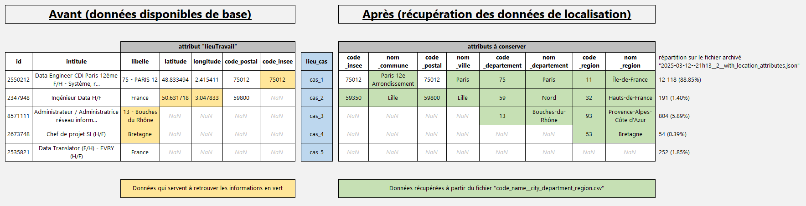

[Retour à la page principale](../README.md)

# 1. Extraction des données par API et Transformations

## 1a. Extraction des données par API

- France Travail (https://francetravail.io/data/api) met à disposition plusieurs APIs, dont "Offres d'emploi v2" (`GET https://api.francetravail.io/partenaire/offresdemploi`).

- Le endpoint `GET https://api.francetravail.io/partenaire/offresdemploi/v2/offres/search` permet de récupérer les offres d'emploi actuelles selon plusieurs paramètres dont :

  - le code des appellations ROME pour filtrer par métier (codes récupérés à partir du endpoint `GET https://api.francetravail.io/partenaire/offresdemploi/v2/referentiel/appellations`) :

    ```json
    { "code": "38971",  "libelle": "Data analyst" },
    { "code": "38972",  "libelle": "Data scientist" },
    { "code": "404278", "libelle": "Data engineer" },
    { "code": "38975",  "libelle": "Data_Manager" },
    ...
    ```

  - le code des pays (codes récupérés à partir du endpoint `GET https://api.francetravail.io/partenaire/offresdemploi/v2/referentiel/pays`) :

    ```json
    { "code": "01", "libelle": "France" },     // inclut les offres en France d'outre-mer et en Corse
    { "code": "02", "libelle": "Allemagne" },  // les pays étrangers ne retournent malheureusement pas d'offres sur les métiers à analyser
    ...
    ```

  - le paramètre `range` qui limite les résultats à 150 offres par requête (avec un status code à `206` si une requête renvoie plus de 150 offres), sachant que l'API ne permet de récupérer que 3150 offres au maximum par appellation ROME.

    - Ainsi, si une requête renvoit 351 offres, il faut enchainer 3 requêtes pour obtenir toutes les offres (la première requête donne les offres `0-149` (status code 206), la deuxième donne les offres `150-299` (status code 206), et la troisième donne les offres `300-350` (status code 200)).


- Cet API nous retourne des offres d'emploi sous forme de documents json avec énormément d'attributs dont l'identifiant de l'offre, son intitulé, sa description, le lieu de travail, des informations sur l'entreprise et sur le contrat, les compétences demandées et l'expérience nécessaires, etc...

- Toutefois, l'API retourne aussi énormément d'offres sans lien avec le métier renseigné en paramètre (par exemple, une requête renseignant l'appellation `Data Engineer` peut renvoyer une offre telle que `Product Owner` car les termes `Data Engineer` peuvent être présents dans la description de l'offre d'emploi).

- On va requêter ainsi un large panel de métiers, dont 29 ayant un lien avec la data, et 32 ayant un lien avec les métiers de la tech (dev, sécurité, devops...), pour maximiser les chances d'obtenir le plus d'offres d'emploi ayant un lien avec les métiers DE, DA et DS, et aussi pour avoir une base de données plus conséquente.

  - En effet, des offres de `Data Engineer` peuvent être présentes en requêtant l'appellation `Data_Manager` par exemple.

- On obtient finalement 61 fichiers json contenant toutes les offres d'emploi liées ou pas à la data, pour la France et DOM-TOM uniquement, l'API de France Travail ne renvoyant quasiment pas d'offre d'emploi pour les autres pays.

  - Ces 61 fichiers json seront concaténés dans un seul fichier json, où les doublons seront supprimés.


- Notes :

  - Les paramètres liés aux dates (`minCreationDate`, `maxCreationDate`, `publieeDepuis`) ne permettent pas d'obtenir des offres expirées (par exemple celles qui ont permis de recruter quelqu'un).

  - Les offres d"emploi retournées peuvent provenir soit de France Travail, soit des `partenaires`, par exemple (`CADREMPLOI`, `DIRECTEMPLOI`, `INDEED`, etc...)


## 1b. Transformation des données

### Conservation des offres en France Métropolitaine uniquement

- On va dans ce projet se focaliser sur les offres en France Métropolitaine.

  - Pour supprimer les offres en dehors de la métropôle, on se basera sur le numéro du département, qui est à 3 chiffres pour les DOM-TOM, et égales à `2A` ou `2B` pour la Corse.

    - Dans ce cas, on supprimera les offres en DOM-TOM et en Corse avec la regex `^(\d{3}|2(A|B))\s-\s`.

  - L'attribut `libelle` donne l'information lorsque qu'une offre se retrouve dans le `cas_3` (voir partie ci-dessous), c'est-à-dire lorsque `libelle` est de la forme "<département> - <nom_du_département>", par exemple : `971 - Guadeloupe`, `974 - Réunion`, `2A - Corse du Sud`, `2B - BASTIA`.


### Ajout des attributs "nom_ville", "nom_commune", "code_departement", "nom_departement", "code_region", "nom_region"

- Le screenshot suivant (issu du fichier `step_1__location_cases.xlsx`) résume la partie décrite ci-dessous :

  


- On a dû générer le fichier `api_extract__transform/locations_information/code_name__city_department_region.csv` pour pouvoir catégoriser les cas décrits ci-après, et ainsi récupérer les attributs `nom_ville`, `nom_commune`, `code_departement`, `nom_departement`, `code_region`, `nom_region`.

    - [todo: écrire le .py + préciser le nom du script]

  - Ce fichier csv :
    - a été généré à partir de 4 fichiers récupérés sur le site de l'insee et sur data.gouv :

      - `v_commune_2024.csv`, `v_departement_2024.csv` et `v_region_2024.csv` (https://www.insee.fr/fr/information/7766585)
      - `cities.csv` (https://www.data.gouv.fr/fr/datasets/villes-de-france/)

    - donne le mapping entre :

      - `code_insee` et `nom_commune`
      - `code_postal` et `nom_ville`
      - `code_departement` et `nom_departement`
      - `code_region` et `nom_region`


- Pour les offres récupérées, l'attribut `lieuTravail` peut renseigner les champs suivants `libelle`, `latitude`, `longitude`, `code_postal` et `code_insee`.

  - Ces champs peuvent permettre de retrouver la ville, le département et/ou la région d'une offre d'emploi.

- Dans les cas décrits par la suite, on part du cas le plus favorable au cas le plus défavorable.

- Pour exemple, les cas suivants donneront une idée de pourcentage d'offres pour chacun des cas, à partir du json disponible en archive : "api_extract__transform/outputs/_archives/2025-03-02--exemples-jsons-et-json-concatenated/2025-03-02--18h36__extraction_occurence_1.json", qui contient 13 639 offres.

- Pour catégoriser les offres, on va écrire pour chacune des offres si elle est dans le `cas_1`, dans le `cas_2`, etc... dans une colonne dédiée (`lieu_cas`).


#### Cas_1 : "code_insee" renseigné

- Dans ce cas, on peut récupérer la ville, le département, et la région.

  - Sur le json archivé, c'est le cas pour 12 118 offres sur 13 639, soit 88.85% des offres.

- Notes :
  - dans ce cas, il se peut que `code_postal` ne soit pas renseigné
  - si `code_insee = NAN`, alors `code_postal = NAN` aussi (donc la colonne code_postal n'est pas utile pour retrouver la ville)


##### Ajout des attributs de localisation

- On a donc le code commune.
- A partir du fichier `codes_city_department_region_names.csv`, on ajoute la ville, le département, et la région.


#### Cas_2 : "code_insee = NAN" (dans ce cas "code_postal = NAN"), mais coordonnées GPS renseignées

- Dans ce cas, on peut récupérer la ville, le département, et la région.

  - Sur le json archivé, c'est le cas pour 191 offres sur 13 639, soit 1.40% des offres.

- Ici, il y a 2 sous-cas :
  - soit les coordonnées GPS sont corrects,
  - soit la valeur de la latitude et la valeur de la longitude sont inversées.

- On va se baser sur https://fr.wikipedia.org/wiki/Liste_de_points_extr%C3%AAmes_de_la_France pour trouver les variations des coordonnées GPS en France Métropolitaine.

- En effet :
  - le point le plus au nord : (51° 05′ 21″ N, 2° 32′ 43″ E)
  - le point le plus au sud : (42° 19′ 58″ N, 2° 31′ 58″ E)
  - le point le plus à l'est : (48° 58′ 02″ N, 8° 13′ 50″ E)
  - le point le plus à l'ouest : (48° 24′ 46″ N, 4° 47′ 44″ O)


- En convertissant ces coordonnées en valeur décimale, on trouve les fourchettes suivantes pour la latitude et la longitude de la France Métropolitaine :

  - Latitude : 42,3328 (Sud) -> 51,0892 (Nord)
  - Longitude : -4,7956 (Ouest) -> 8,2306 (Est)


- Pour vérifier si la latitude a été inversée avec la longitude :
  - on vérifie si la latitude renseignée est bien comprise entre 42.3328 et 51.0892,
    - si oui, ça correspond à une latitude de la France Métropolitaine,
    - si non, on vérifie que la valeur renseignée pour la longitude l'est bien
      - si oui, on inversera la valeur de la latitude avec la valeur de la longitude.


##### Ajout des attributs de localisation

- La lib geopy permet de retrouver plusieurs informations (`city`, `city_district`, `postcode`, `suburb`, `municipality`, `state`, `town`...), mais tous ces attributs ne sont pas toujours disponibles...
  - En revanche, l'information qui semble toujours être retourné est le code postal.

- A partir du code postal, on ajoute la ville, le département et la région.


- Parfois le code postal retourné par geopy n'est pas présent dans le fichier `code_name__city_department_region.csv` (et donc non présent dans https://www.data.gouv.fr/fr/datasets/villes-de-france/, ni sur https://www.data.gouv.fr/fr/datasets/base-officielle-des-codes-postaux/).

  - Par exemple, sur le json archivé, c'est le cas pour 4 offres où geopy renvoit les codes postaux "34009", "06205", "57045", "13030".

  - Dans ce cas, on va prendre les 2 premiers digits du code postal pour avoir le département, et récupérer la région.


- Notes :

  - C'est assez long (~5 minutes pour 191 offres) car la méthode `geolocator.reverse()` fait une requête http pour chaque offre.

  - Geopy retourne un code postal, mais ce code postal peut être associé à plusieurs villes.
    - Par conséquent, si une offre renseigne le code postal 78310, elle peut être soit à Coignières soit à Maurepas, qui partagent le même code postal, ce qu'on ne peut pas deviner.
    - Cela ne pose pas vraiment problème, étant donné qu'en général plusieurs villes qui ont le même code postal sont relativement proches/voisines.


#### Cas_3 : "code_postal = code_insee = latitude = longitude = NAN", mais "libelle = 'numéro_département - nom_département'"

- Dans ce cas, on ne peut pas retrouver la ville, mais on peut retrouver le département, et par conséquent la région.

  - Sur le json archivé, c'est le cas pour 804 offres sur 13 639, soit 5.89% des offres.


##### Ajout des attributs de localisation

- Dans ce cas, on a par exemple `libelle = 75 - Paris (Dept.)`, donc on va extraire le code du département dans la colonne `code_departement`, et récupérer `nom_departement`, `code_region` et `nom_region` à partir du fichier `code_name__city_department_region.csv`.


#### Cas_4 : "code_postal = code_insee = latitude = longitude = NAN", mais "libelle = nom_région"

- Dans ce cas, on a que la région, et on ne peut donc pas avoir la ville ni le département.

  - Sur le json archivé, c'est le cas pour 54 offres sur 13 639, soit 0.39% des offres.


- A noter que le nom de la région n'est pas toujours homogène, par exemple, on peut avoir "Ile-de-France" et "Île-de-France" (i avec ou sans accent circonflexe), ce qui est traité dans le script.


##### Ajout des attributs de localisation

Dans ce cas, on écrira `code_region` et `nom_region` à partir du fichier `code_name__city_department_region.csv`.


#### Cas_5 : "code_postal = code_insee = latitude = longitude = NAN", et "libelle = ("FRANCE"|"France"|"France entière")"

- C'est le cas le plus défavorable qui ne permet pas de retrouver la ville, le département ni la région.

  - Sur le json archivé, c'est le cas pour 252 offres sur 13 639, soit 1.85% des offres.


- On pourrait aller plus loin, et tenter de retrouver l'information dans l'intitulé ou la description de l'offre d'emploi, mais on ne le fera pas ici.


## 1c. Script "api_extract__transform/extract_and_transform_data.py"

Tout se base dans le dossier `api_extract__transform/outputs/offres/1--generated_json_file`, qui doit contenir zéro fichier json, ou un seul fichier json.

  - S'il y a plusieurs fichiers json dans ce dossier, le script s'arrête.

  - S'il y a aucun fichier json dans ce dossier, le script :

    - 1. supprime tous les fichiers json du dossier `api_extract__transform/outputs/offres/0--original_json_files_from_api`
    - 2. récupère toutes les offres par API (61 fichiers json)
    - 3. concatène les 61 fichiers en 1 fichier json
    - 4. retire de ce fichier toutes les offres qui sont hors de la France métropolitaine
    - 5. ajoute des attributs de localisation `nom_commune`, `nom_ville`, `code_departement`, `nom_departement`, `code_region`, `nom_region` à partir du code insee, des coordonnées GPS et des informations renseignées dans l'attribut `libelle`, comme le département ou la région.
    - 6. ajoute un attribut `dateExtraction` à la date du jour actuelle, qui correspond à la date d'extraction des données par API
    - 7. ajoute un attribut `datePremiereEcriture` à la date du jour actuelle, qui correspond à la date où on écrit une offre dans la base la première fois.

  - S'il y a un fichier json dans ce dossier, le script :
    - supposons que le nom de ce fichier `json_1` soit `2025-04-09--14h19__extraction_occurence_2.json`
    - le script va créer un autre fichier `json_2` à la date/heure du jour et incrémenter l'occurence, le fichier `json_2` s'appellera par exemple `2025-04-12--21h41__extraction_occurence_3.json`
    - les étapes 1-6 précédentes sont exécutées pour `json_2`
    - le script va ensuite concaténer avec "`json_1` - `json_2`" et `json_2` (il y a une intersection entre `json_1` et `json_2`) dans `json_2`
    - l'attribut `datePremiereEcriture` aura la date du jour pour toutes les nouvelles offres, mais prendra les anciennes valeurs pour les anciennes offres
    - `json_1` est déplacé dans le dossier `archive_json_files`, laissant `json_2` être le seul fichier json
       dans le dossier `api_extract__transform/outputs/offres/1--generated_json_file`


Le fichier json servira d'entrée à un autre script `load_sql/2--script_insert_into_tables.py`.