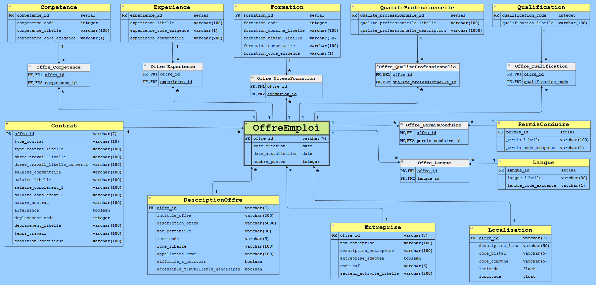

[Retour à la page principale](../README.md)

# 2. Chargement des données dans une base de données relationnelle

- L'API de France Travail contient beaucoup d'attibuts pour une offre d'emploi, qui seront quasiment tous exploités par la suite.

    - Seuls les attributs liés aux "contacts" et aux "agences" ne seront pas conservé, n'apportant pas d'utilité.

- Pour la suite, une modélisation snowflake est utilisée :

    

- Le SGBD PostgreSQL sera utilisé, et la base de données sera hébergée dans un conteneur Docker exécutant le service PostgreSQL.

- Les données issues du json généré dans la première étape seront récupérées et écrites en base avec la librairie psycopg2.

## Problématiques rencontrées lors de la mise à jour de la base de données après récupération de nouvelles offres

### Evolution de "qualification_code"

Certaines offres voient leur `qualification_code` évoluer, par exemple :

  - `offre_id = 188LLXS` (`intitule = Technicien de gestion de données sur équipement (H/F)`) :
    - lors de `date_extraction = 2025-03-02` : `qualification_code = 7`
    - lors de `date_extraction = 2025-04-05` : `qualification_code = 8`

  - `offre_id = 186XNDD` (`intitule = Coach sportif(ve) (H/F)`) :
    - lors de `date_extraction = 2025-03-02` : `qualification_code = 6`
    - lors de `date_extraction = 2025-04-05` : `qualification_code = 7`

Avec l'attribut `date_extraction` qui vient de la table OffreEmploi, on n'a pas moyen de savoir quelle ligne parmi les suivantes sont les plus récentes, car pour chaque mise à jour, l'attribut `date_extraction` est mis à jour et prend la valeur `2025-04-05`.

  | offre_id | qualification_code | date_extraction |
  | -------- | ------------------ | --------------- |
  | 188LLXS  | 7                  | 2025-04-05      |
  | 188LLXS  | 8                  | 2025-04-05      |
  | 186XNDD  | 6                  | 2025-04-05      |
  | 186XNDD  | 7                  | 2025-04-05      |

Ce qui nous intéresse est d'avoir la date d'extraction réelle :

  | offre_id | qualification_code | date_extraction |
  | -------- | ------------------ | --------------- |
  | 188LLXS  | 7                  | 2025-03-02      |
  | 188LLXS  | 8                  | 2025-04-05      |
  | 186XNDD  | 6                  | 2025-03-02      |
  | 186XNDD  | 7                  | 2025-04-05      |

pour ne garder que le `qualification_code` le plus récent si 1 offre_id est présente avec 2 qualification_code différents :

  | offre_id | qualification_code | date_extraction |
  | -------- | ------------------ | --------------- |
  | 188LLXS  | 8                  | 2025-04-05      |
  | 186XNDD  | 7                  | 2025-04-05      |

Il faut donc ajouter `date_extraction` dans la table `offre_qualification`.

### Evolution de "experienceExige" et "experienceLibelle"

Même problématique avec certaines offres qui voient leur `experienceExige` et leur `experienceLibelle` évoluer, par exemple :

  - `offre_id = 1316532` (`intitule = Administrateur linux (H/F)`) :

    - lors de `date_extraction = 2025-03-02` : `experienceExige = E` et `experienceLibelle = Expérience exigée de 3 An(s)` (par exemple `experience_id = 6`)

    - lors de `date_extraction = 2025-04-05` : `experienceExige = D` et `experienceLibelle = Débutant accepté` (par exemple `experience_id = 2`)

