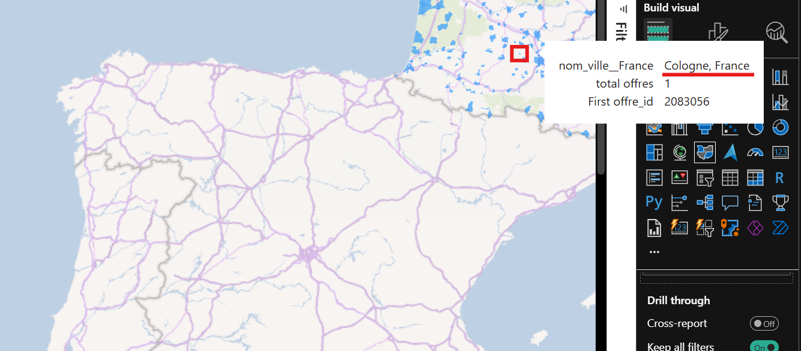

[Retour à la page principale](../README.md)

# 3. Consommation des données

## 3.a. Power BI

### Connexion avec la db

- cf https://learn.microsoft.com/fr-fr/power-query/connectors/postgresql

- `Blank report`

- `Get data` > `PostgreSQL database` > `connect`

  - fenêtre `PostgreSQL database` :
    - `Server : localhost`
    - `Database : francetravail`
    - `Data Connectivity mode : Import`
      - Notes :
        - Import → Charge toutes les données en mémoire de Power BI.
        - DirectQuery → Interroge PostgreSQL en temps réel sans stocker les données localement.
    - `Advanced options` : pas touché

  - fenêtre `localhost;francetravail` :
    - `User name : mhh`
    - `Password : mhh`
    - `Select which level to apply these settings to : localhost`

  - fenêtre `Encryption Support` :

    - `We were unable to connect to the data source using an encrypted connection. To access this data source using an unencrypted connection, click OK.` => On valide.

  - fenêtre `Navigator`, où on peut sélectionner les 19 tables.

    - On sélectionne tout, puis `Load`.

      - fenêtre `Processing Queries` (Determining automatic transformations...)

        - On peut `Skip`, ce qu'on va faire après une dizaine de minutes, car ça bloque sur la table `formation` (pourtant, toutes les autres tables sont bien validées, et on arrive bien à voir le contenu de la table `formation` par une requête sql)

        - Note : on n'a pas cette fenêtre la deuxième fois (Power BI avait crashé quand j'ai voulu sauvegardé la première fois)

          - fenêtre `Load` (qui finit par bien aboutir)

### Model view

- Onglet `model view` : on voit bien les 19 tables, on doit refaire les liens créés automatiquement.

  - On procède comme le diagramme UML qu'on a défini (voir `load_sql/UML.drawio`)

- On masque les colonnes non utilisées.

- Paramétrer `Cross-filter direction = Both` pour certains liens est nécessaire pour la data viz.

### Table view

- Création table de date

- Création de colonnes :
  - Date Différence = DATEDIFF('Offre Emploi'[Date Création], 'Offre Emploi'[Date Actualisation], DAY)

### Transformations sur Power BI

#### Renommage de toutes les colonnes

- C'est juste pour Power BI.

- On renomme les colonnes avoir des noms plus facile à lire dans les rapports comme :

  - `Offre ID` (au lieu de `offre_id`)
  - `Durée Travail Libellé` (au lieu de `duree_travail_libelle`)

#### Attribut "Liste Mots-Clés"

- Exemple de valeur pour une offre : `{etl,git,"power bi",python,sql,tableau}`

- On supprime les accolades et les guillemets.
  - ce qui donne pour l'exemple : `etl,git,power bi,python,sql,tableau`

- On éclate la colonne en faisant `Split Column` > `By delimiter` (Split into Rows)
  - l'offre est donc splittée sur 6 lignes avec un seul mot-clé dans la colonne `Liste Mots Clés`

#### Ajout de variables avec le nom des villes, départements et région modifiés pour la data viz

##### Ajout de la variable "Nom Ville Modifié"

- Dans le `report view` / carte mondiale, on a des villes françaises qui sont situées dans d'autres pays, par exemple :

  - offre_id = `2083056` dans la ville `Cologne` (code postal 32 430) en région Occitanie, département Gers  => placé en Allemagne (NOK, car on est censé avoir que des offres en France)

    

  - offre_id = `2757953` dans la ville `La Réunion` (code postal 47 700) en région Nouvelle-Aquitaine, département Lot-et-Garonne  => placé en France (OK)

    

- Comme vu dans le dernier screenshot, pour avoir les villes placées en France, on définit une colonne `Nom Ville Modifié` avec le nom de la ville suffixé avec `, France` (par exemple `Cologne, France`).

##### Ajout de la variable "Nom Département Modifié"

Même chose pour le département de la `Lot` qui est placé en Lituanie, on ajoute une colonne qui suffixera le nom du département avec `, France` :

  - Département `Lot` en Lituanie :

    

  - Département `Lot` en France :

    

##### Ajout de la variable "Nom Région Modifié"

- Quand on affiche la carte du monde avec les régions de la France, on constate que 2 régions (la Bretagne et l'Occitanie) ne sont pas complètement coloriées comme les autres régions :

  - pour la Bretagne :

    

  - pour l'Occitanie :

    

- Changer le `Data category` (à `County` ou `State or Province`) résout le problème pour l'Occitanie mais pas la Bretagne.

- Le contournement est d'ajouter une colonne, où on préfixera le nom de la région de `Région d('|de|du|des)` en fonction des régions, par exemple :

  - `Région d'Île-de-France`
  - `Région de Normandie`
  - `Région des Hauts-de-France`
  - `Région du Grand Est`

- A noter qu'il y a une exception pour `Région Bourgogne-Franche-Comté` (pas de `de`).

- Cela résout bien le problème de colorisation :

  - pour la Bretagne :

    

  - pour l'Occitanie :

    

## 3.b. Requêtes SQL

### Transformations pour écrire l'attribut "metier_data"

- Pour identifier les offres de "Data Engineer" parmi toutes les offres récupérées, le premier réflexe serait de filtrer sur le rome_code `M1811` qui correspond à `Data engineer`, mais on se rend compte que les offres d'emploi associées ne sont pas toutes liées à ce poste.

- On retrouve en effet des postes d'architecte, d'ingénieur base de données, de data analyst, de data manager, de technicien data center, etc... (voir résultats de la requête `sql_requests/1_requests/offers_DE_DA_DS/10--table_descriptionoffre__rome_M1811.pgsql`)  # chemin à modifier

- L'attribut `intitule_offre` de la table `DescriptionOffre` sera donc utilisé pour filtrer les offres voulues (ici : `Data Engineer`, `Data Analyst` et `Data Scientist`) grâce à des requêtes qui utilisent des regex, écrivant la valeur `DE`, `DA`, `DS` dans l'attribut `metier_data` (voir `sql_requests/0_transformations`).

### Transformations pour écrire les attributs "salaire_min" et "salaire_max"

#### Contexte

- Pour écrire ces attributs qui donnent les salaires minimum et maximum annuels, on se base sur l'attribut `salaire_libelle`, qui n'est pas toujours renseigné.

- Lorsqu'elle l'est, les valeurs pour cet attribut sont parfois mal renseignées par les recruteurs :

  - qui inversent parfois le salaire annuel avec le salaire mensuel [auquel cas on fera un traitement (voir ci-dessous) pour avoir les bons salaires] :

    - `Annuel de 486,00 Euros à 1801,00 Euros` (c'est sûrement un salaire mensuel et non annuel)
    - `Mensuel de 32000,00 Euros à 40000,00 Euros` (c'est sûrement un salaire annuel et non mensuel)

  - qui inversent les salaires min et max [auquel cas on les inversera] :

    - `Annuel de 60000,00 Euros à 40000,00 Euros`

  - qui se trompent sûrement dans les salaires renseignés :

    - `Autre de 30000,00 Euros à 400000,00 Euros` (salaire max = 400k : sûrement erroné avec un 0 en trop)
    - `Annuel de 80000,00 Euros à 850000,00 Euros` (idem avec salaire max = 850k)
    - `Annuel de 550000.0 Euros sur 12.0 mois` (salaire = 550k : sûrement erroné avec un 0 en trop)

- D'autre part, il faut noter que beaucoup d'offres ne renseignent que le taux horaire [auquel cas on écrira null], par exemple :

  - `Annuel de 11,00 Euros` (c'est sûrement un taux horaire)
  - `Horaire de 11.88 Euros sur 12 mois`

#### Hypothèses

- Comme on n'est pas certain si les salaires indiqués sont mensuels ou annuels (à cause des erreurs des recruteurs), on va prendre les hypothèses suivantes :
  - salaire mensuel ∈ [1 666, 12 500]
  - salaire annuel ∈ [20 000, 150 000]

- Donc, on considère que si salaire mensuel :
  - inférieur à 1666 € (20k), ce n'est pas un salaire mensuel (pour écarter les taux horaires, les salaires à mi-temps, les salaires en alternance...)
  - supérieur à 12 500 € (150k), c'est très certainement une faute de frappe (il y a vraiment très peu d'offres dans ce cas, peut-être 4 pour 13k offres)

    - par exemple :

      - Ingénieur systèmes embarqués (H/F) : `Annuel de 80000,00 Euros à 850000,00 Euros` (80k - 850k)
      - Administrateur Bases de données - DBA / Microsoft SQL Server(H/F) (H/F)	: `Mensuel de 400000.0 Euros à 450000.0 Euros sur 12.0 mois` (400k - 450k)
	    - Chef de Projet EDI (H/F) : `Annuel de 50000.0 Euros à 540000.0 Euros sur 12.0 mois` (50k - 540k)
      - Data Analyst H/F: `Annuel de 45000,00 Euros à 550000,00 Euros` (45k - 550k)

#### Algorithme

- Pour les transformations, on va considérer les cas suivants.

- Si "salaire_libelle" donne :

  - A. une fourchette de salaire ("cas fourchette") :

    - `Annuel de 60000.0 Euros à 90000.0 Euros`
    - `Annuel de 60000.0 Euros à 90000.0 Euros sur 12.0 mois`
    - `Annuel de 60000.0 Euros à 90000.0 Euros sur 13.0 mois`
    - `Mensuel de 1767.00 Euros à 2600.00 Euros sur 12 mois`
    - `Mensuel de 1767.00 Euros à 2600.00 Euros`
    - `Autre de 1910,00 Euros à 2050,00 Euros`
    - `De 40000,00 Euros à 40000,00 Euros`
    - `Autre de 40000,00 Euros à 45000,00 Euros`
    - `Cachet de 50000,00 Euros à 55000,00 Euros`

      - cas 1 : Si salaire minimum récupéré > salaire maximal récupéré *ET* salaires min+max récupérés ∈ [1 666 €, 12 500 €] (on considère que c'est un salaire mensuel)
        - alors on inverse les salaires mensuels minimum et maximum.

          - exemple :
            - `Mensuel de 5500.0 Euros à 4200.0 Euros sur 12.0 mois`

      - cas 2 : Si salaires min+max récupérés ∈ [1 666 €, 12 500 €] (on considère que c'est un salaire mensuel)
        - alors on récupère les salaires minimum et maximum et on les multiplie par 12.

          - exemples :
            - `Annuel de 1800,00 Euros à 2000,00 Euros`
            - `Mensuel de 2900,00 Euros à 3000,00 Euros`
            - `Autre de 1855,26 Euros à 1855,26 Euros`

      - cas 3 : Si salaire minimum récupéré > salaire maximal récupéré *ET* salaires min+max récupérés ∈ [20 000 €, 150 000 €] (on considère que c'est un salaire annuel)
        - alors on inverse les salaires annuels minimum et maximum.

          - exemple :
            - `Annuel de 60000,00 Euros à 40000,00 Euros`

      - cas 4 : Si salaires min+max récupérés ∈ [20 000 €, 150 000 €] (on considère que c'est un salaire annuel)
        - alors on récupère les salaires minimum et maximum.

          - exemples :
            - `Annuel de 55000,00 Euros à 65000,00 Euros`
            - `Mensuel de 45000.0 Euros à 50000.0 Euros sur 12.0 mois`
            - `Autre de 45000,00 Euros à 55000,00 Euros`

      - cas 5 : Sinon, dans les autres cas
          - alors salaire min/max = NULL.

            - exemples où `salaire minimum <= 1 666 €` :
              - `Annuel de 25,00 Euros à 30,00 Euros`
              - `Mensuel de 850,00 Euros à 950,00 Euros`
              - `De 13,00 Euros à 14,00 Euros`

            - exemples où `salaire max >= 150 000 €` :
              - `Annuel de 80000,00 Euros à 850000,00 Euros`
              - `Mensuel de 400000.0 Euros à 450000.0 Euros sur 12.0 mois`
              - `Autre de 30000,00 Euros à 400000,00 Euros`

            - exemple où `salaire n'appartient pas aux fourchettes de salaires mensuels [1 666, 12 500] ni annuels [20 000, 150 000]` :

              - `Annuel de 19000,00 Euros à 19000,00 Euros`

  - B. un salaire unique ("cas salaire unique") :

    - `Annuel de 48000.0 Euros sur 12.0 mois`
    - `Annuel de 50000,00 Euros`
    - `Mensuel de 45000.0 Euros sur 12.0 mois`

      - cas 2 : Si salaire récupéré ∈ [1 666 €, 12 500 €] (on considère que c'est un salaire mensuel)
        - alors on récupère le salaire et on le multiplie par 12.

          - exemples :
            - `Mensuel de 4410,00 Euros`

      - cas 4 : Si salaire récupéré ∈ [20 000 €, 150 000 €] (on considère que c'est un salaire annuel)
        - alors on récupère le salaire.

          - exemples :
            - `Annuel de 55000.0 Euros sur 12.0 mois`

      - cas 5 : Sinon, dans les autres cas
        - alors salaire min/max = NULL.

          - exemples :
            - `Annuel de 1000,00 Euros`
            - `Mensuel de 12,00 Euros`
            - `Annuel de 550000.0 Euros sur 12.0 mois`

#### Exemples d'offres réelles avec les salaires qu'on fixe

| offre_id | intitule_offre                         | salaire_libelle                              | get_salaire_min | get_salaire_max | cas                | sous-cas                                    | salaire_min | salaire_max |
| -------- | -------------------------------------- | -------------------------------------------- | --------------- | --------------- | ------------------ | ------------------------------------------- | ----------- | ----------- |
| -        | -                                      | -                                            | -               | -               | -                  | 1 (min>max + mois ∈ [1 666, 12 500])        | -           | -           |
| 2430874  | Chef de projet (H/F)                   | Mensuel de 5880,00 Euros à 8085,00 Euros     | 5880            | 8085            | cas fourchette     | 2 (mois ∈ [1 666, 12 500])                  | 70560       | 97020       |
| 188TYKG  | MANAGEUR-EUSE DE TRANSITION (H/F)      | Mensuel de 3136.0 Euros sur 12.0 mois        | 3136            | 12              | cas salaire unique | 2 (mois ∈ [1 666, 12 500])                  | 37632       | 37632       |
| 2861769  | Chef de projet (H/F)                   | Annuel de 60000,00 Euros à 40000,00 Euros    | 60000           | 40000           | cas fourchette     | 3 (min>max + an ∈ [20 000, 150 000])        | 40000       | 60000       |
| 2710913  | Responsable BI / Data (H/F)            | Annuel de 75000,00 Euros à 90000,00 Euros    | 75000           | 90000           | cas fourchette     | 4 (an ∈ [20 000, 150 000])                  | 75000       | 90000       |
| 188LKVH  | Technicien d'exploitation informatique | Annuel de 25200.0 Euros sur 12.0 mois        | 25200           | 12              | cas salaire unique | 4 (an ∈ [20 000, 150 000])                  | 25200       | 25200       |
| 6071688  | Management de Projets Numériques H/F   | Mensuel de 850,00 Euros à 950,00 Euros       | 850             | 950             | cas fourchette     | 5 (autres cas : salaire < 1666 €)           | null        | null        |
| 2554957  | Chef de Projet Eds Entrepôt de Données | Annuel de 19000,00 Euros à 19000,00 Euros    | 19000           | 19000           | cas fourchette     | 5 (autres cas : salaire ∈ ]12 500, 20 000[) | null        | null        |
| 2968347  | Gestionnaire ERP (H/F)                 | Mensuel de 352800,00 Euros à 411600,00 Euros | 352800          | 411600          | cas fourchette     | 5 (autres cas : salaire > 150 000 €)        | null        | null        |

- A noter aussi que les salaires des offres en alternance seront exclues ici car leur salaire est très majoritairement inférieur au seuil minimum qu'on a défini ici.

### Analyse du jeu de données à travers des requêtes SQL

- voir le dossier `sql_requests/1_requests/offers_DE_DA_DS/`

- Au moins une requête sera faite pour chaque table de dimension pour mieux comprendre notre jeu de données.