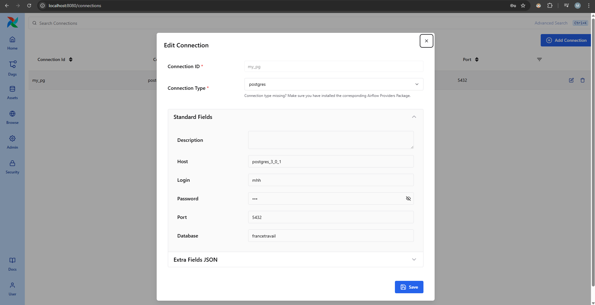

[Retour à la page principale](../README.md)

# 5. Airflow

## 5.1. Intérêts d'Airflow dans ce projet

Ils sont multiples :

  - vision claire du workflow complet à travers la vue graph du DAG
  - voir à quelle fonction un problème a eu lieu d'un coup d'oeil
  - lancer le DAG à la fréquence désirée (par exemple, tous les jours à 20h)
  - paralléliser certaines tâches, donc gain de temps


## 5.2. Mise en place

conf docker + arbo

Testé avec les versions 2.11.0 et 3.0.1 :

Note : "problème" rencontré sur la 3.0.1 (incohérence entre la `grid view` et la `graph view`) :
  - https://stackoverflow.com/questions/79659430/problem-with-tasks-and-tasks-groups-order-on-the-grid-view-on-airflow-3-0-1
  - https://github.com/apache/airflow/issues/51538

Finalement, on restera sur la version 3.0.1 (on garde la conf 2.11.0).


## 5.3. Configuration à faire dans la GUI

(fait en 3.0.1)

Pour le `dag_id="dag_2_write_to_db"`, il faut définir dans la GUI une connexion Postgres, comme suit :

`Admin` > `Connections` > `Add Connection` :

  - Connection ID     : my_pg
  - Connection Type   : postgres
  - Standard Fieds
    - Host            : postgres_3_0_1  (note : c'est le nom du conteneur du service postgres, voir le fichier `docker-compose--airflow-3-0-1.yml`)
    - Login           : mhh
    - Password        : mhh
    - Port            : 5432
    - Database        : francetravail


  


## 5.4. Notes

### SQLExecuteQueryOperator vs PostgresOperator

Notes concernant l'erreur :

  ```bash
      from airflow.operators.postgres_operator import PostgresOperator
  ModuleNotFoundError: No module named 'airflow.operators.postgres_operator'
  ```

  à cause de :

    ```python
    from airflow.operators.postgres_operator import PostgresOperator
    ```

Après s'être connecté sur le conteneur "worker" :

  ```bash
  default@0ab352f980fd:/opt/airflow$ pip list | grep apache-airflow-providers-postgres
  apache-airflow-providers-postgres         6.1.3
  ```

=> https://airflow.apache.org/docs/apache-airflow-providers-postgres/6.1.3/


Change log : https://airflow.apache.org/docs/apache-airflow-providers-postgres/6.2.0/changelog.html#

  ```md
  à partir de la 6.0.0 :
  Remove airflow.providers.postgres.operators.postgres.PostgresOperator. Please use airflow.providers.common.sql.operators.sql.SQLExecuteQueryOperator instead.
  ```


Conclusion : `PostgresOperator` est deprecated au profil de `SQLExecuteQueryOperator` avec la version `apache-airflow-providers-postgres` utilisée (6.1.3).
C'est ce qu'il faudra l'exécution des requêtes SQL.

  ```bash
  default@0ab352f980fd:/opt/airflow$ cat /home/airflow/.local/lib/python3.12/site-packages/airflow/providers/common/sql/operators/sql.py  |  grep SQLExecuteQueryOperator
  class SQLExecuteQueryOperator(BaseSQLOperator):
  ```
